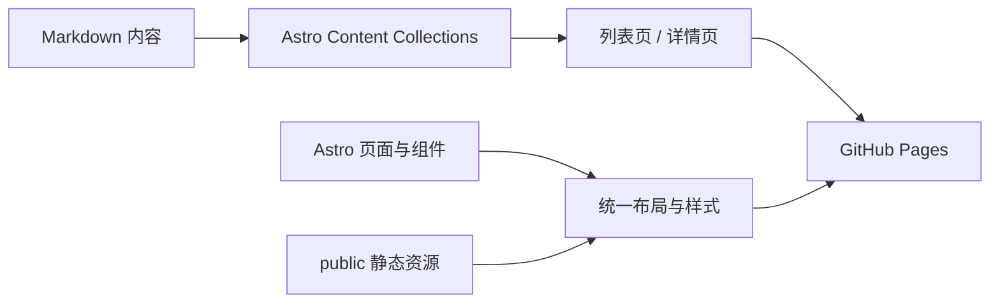
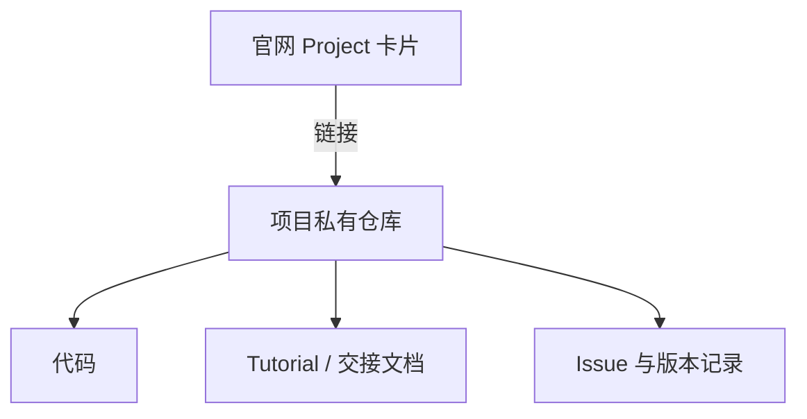

# Hello World Vision · Vision Website

浙江大学 RoboMaster 战队 Hello World 视觉组官方网站，用于展示团队、沉淀入组培训资料，并提供各个视觉项目的入口。

网站是一个以 Astro 为核心的静态内容站点：页面结构由 Astro 组件负责，文章内容由 Markdown Content Collections 负责，项目卡片和静态资源由 `public/` 资源共同管理。

## 项目架构



- `src/pages/`：页面路由。首页、培训列表、文章详情和 Project 项目卡片都在这里。
- `src/content/`：可维护的 Markdown 内容，由 `src/content.config.ts` 校验 frontmatter。
- `src/layouts/`：全站布局和文档阅读布局。
- `src/components/`：Header、Footer、主题切换、粒子背景等可复用组件。
- `src/styles/global.css`：Tailwind 全局样式、颜色变量、卡片样式和动画。
- `public/`：不需要 Astro 转换的静态文件，例如项目卡片图片。

## 文件结构

```text
.
├── public/
│   ├── images/project/           # Project 卡片图片
│   └── favicon.*
├── src/
│   ├── components/               # 通用组件
│   ├── layouts/                  # BaseLayout / DocLayout
│   ├── pages/
│   │   ├── index.astro           # 首页
│   │   ├── induction-training/   # 入组培训列表与详情
│   │   ├── project.astro         # Project 八个项目入口卡片
│   │   ├── docs/                 # 算法与开源文档页面
│   │   └── [...slug].astro       # About 等 Markdown 顶级页面
│   ├── content/
│   │   ├── induction/            # 入组培训 Markdown
│   │   ├── pages/                # about 等独立页面 Markdown
│   │   ├── algorithms/           # 算法教程
│   │   └── open-source/          # 开源项目介绍
│   ├── styles/global.css
│   └── content.config.ts         # 内容集合与字段校验
├── astro.config.mjs
└── tailwind.config.mjs
```

## 内容维护

### 1. Training：入组培训文档

培训文档放在 `src/content/induction/`，文件名建议使用数字前缀控制学习顺序，例如 `21-新主题.md`。

注意事项：

- 必须填写 `title`、`description`、`author`、`date`；可填写 `tags`、`status` 和 `draft`。
- `status: done` 表示已完成，`status: todo` 表示计划中的文档。
- `draft: true` 的文档不会展示，适合暂存未完成内容。
- 图片放在同目录的 `images/` 下，并使用相对路径，例如 ``。
- 内容应尽量包含环境、前置知识、操作步骤、验证方法和常见错误，方便新人复现。
- 修改已有文档时，尽量保留原有标题层级，避免影响目录和已有链接。

### 2. About：团队介绍与 Q&A

About 页面是 `src/content/pages/about.md`。团队介绍、技术方向、培养体系和成员说明统一维护在这里。

建议持续补充 `Q&A` 小节，回答新成员和访客经常提出的问题：

```markdown
## Q&A

### 没有机器人基础可以加入吗？

可以。按照入组培训路线逐步学习，并在实践中完成项目即可。
```

Q&A 的维护原则是：问题具体、回答简洁、内容可验证。涉及招新时间、学分政策、比赛规则等可能变化的信息，应注明适用时间并及时更新。

### 3. Project：项目卡片与私有仓库

Project 页面由 `src/pages/project.astro` 管理，目前以八个卡片展示项目入口。卡片数据集中在文件顶部的 `projects` 数组中：

```ts
{
  title: '项目名称',
  subtitle: 'PROJECT NAME',
  href: 'https://github.com/组织名/私有仓库',
  image: \`\${base}images/project/project-name.png\`,
  icon: 'mdi:robot-outline',
  external: true,
}
```

维护 Project 时请注意：

- 项目的详细代码、教程和交接内容主要写在项目自己的仓库中，不直接堆积在官网仓库里。
- 官网只维护项目名称、简介、卡片图片和跳转地址。
- 私有仓库地址可以写入 `href`；网站只负责跳转，不会展示仓库内容。
- 卡片图片放在 `public/images/project/`，文件名使用英文或拼音，避免空格和特殊字符。
- 外部 GitHub 地址设置 `external: true`，会在新标签页打开。
- 尚未确定的项目可以暂时使用 `href: '#'`，确定仓库后再替换。



## 发布流程

内容维护完成后，将修改提交并推送到 `main` 分支，GitHub Actions 会自动发布到 GitHub Pages。

提交前建议确认：

1. frontmatter 字段完整，标题和链接没有拼写错误。
2. 图片路径与实际文件名一致。
3. Project 卡片的跳转地址可以正常访问。
4. 不要把密码、Token、私有仓库代码或其他敏感信息提交到本仓库。

线上地址：<https://hello-world-vision.github.io/Vision_Website/>

