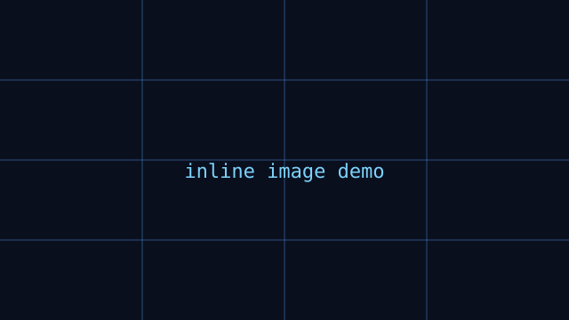

---
# ==============================================================================
# 算法教程模板（src/content/algorithms/ 下的每个 .md 文件 = 一篇文章）
# 把本文件复制一份并重命名（如 02-卡尔曼滤波.md），按字段填写即可。
#
# 【必填】title       文章标题
# 【必填】description 一句话摘要（展示在列表卡片 / SEO 描述）
# 【必填】author      作者
# 【必填】date        发布日期（YYYY-MM-DD）
# 【选填】tags        标签数组
# 【选填】cover       封面图：相对路径 ./images/xxx.png（图片放在同目录 images/ 下）
# 【选填】draft       置为 true 则暂不发布
#
# 正文直接写标准 Markdown 即可：代码块会自动高亮（Shiki），
# 支持 H1~H6、表格、引用、列表等全部语法。
# ==============================================================================
title: "装甲板识别入门：从像素到目标框"
description: "面向视觉组新人的第一篇教程，介绍目标检测的经典流程：预处理、轮廓提取、坐标解算。"
author: "视觉组 · 杨佳轩"
date: 2026-03-01
tags: ["OpenCV", "目标检测", "入门"]
cover: ./images/armor-cover.svg
draft: false
---

## 写在前面

> 本文假设你已经会写 Python / C++，并安装了 OpenCV。
> 如果还没有，先跑一遍官方安装教程再回来。

视觉自瞄的第一步，就是**从相机画面里找到敌人的装甲板**。
下面我们用最经典的「颜色分割 + 轮廓拟合」路线演示一遍。

## 1. 图像预处理

> 正文中的图片直接使用相对路径即可（图片放在与 `.md` 文件同级的 `images/` 文件夹中）：



拿到一帧图像后，首先把颜色空间从 BGR 转换到 HSV，便于按颜色范围抠出目标。

```cpp
cv::Mat frame, hsv, mask;
// frame = 从相机读取的一帧
cv::cvtColor(frame, hsv, cv::COLOR_BGR2HSV);
cv::inRange(hsv, cv::Scalar(0, 43, 46), cv::Scalar(10, 255, 255), mask);
```

## 2. 提取轮廓

对掩码图做形态学闭运算，再提取轮廓，按面积/宽高比过滤噪声：

```python
contours, _ = cv2.findContours(mask, cv2.RETR_EXTERNAL, cv2.CHAIN_APPROX_SIMPLE)
lights = []
for c in contours:
    x, y, w, h = cv2.boundingRect(c)
    if w * h < 200:          # 过滤太小的噪点
        continue
    if h / w < 2.5:          # 灯条应为竖长条
        continue
    lights.append((x, y, w, h))
```

## 3. 灯条配对与坐标解算

把成对的左右灯条拟合成一个装甲板，再通过 PnP 解出相机坐标系下的 3D 坐标。

| 环节 | 手段 | 目标 |
| --- | --- | --- |
| 预处理 | HSV 阈值 | 分离颜色目标 |
| 特征提取 | 轮廓宽高比/面积 | 过滤灯条候选 |
| 配对 | 角度 + 距离约束 | 组成装甲板 |
| 解算 | PnP (solvePnP) | 得到 3D 位姿 |

## 4. 下期预告

下一篇我们介绍如何用 `KalmanFilter` 对解算结果做时序滤波，
让云台在目标被短暂遮挡时依然平滑地"咬住"目标。
