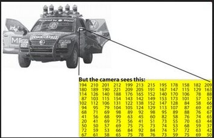

本教程基于 2025 哨兵开源代码展开，前半部分讲解 OpenCV 基础知识，后半部分结合开源代码解释 OpenCV 在 RoboMaster 比赛中常用的功能。

OpenCV 是自瞄部分常用的工具，能很好地解决传统视觉处理的问题。真正的自瞄代码涉及的图像处理方式并不限于下面所讲的内容。

下表是 `autoaim_sentry_2025` 里涉及的 OpenCV 内容：

| 文件                                               | 位置     | OpenCV 做的事                                                                            |
| -------------------------------------------------- | -------- | ---------------------------------------------------------------------------------------- |
| `autoaim_camera/src/camera_node.cpp`             | 116–172 | 从海康 SDK 的原始 buffer 构造`cv::Mat`，`resize` 到模型输入尺寸，再填进 ROS 图像消息 |
| `autoaim_detector/src/detector_node.cpp`         | 127      | `cv_bridge::toCvCopy` 把 ROS 图像消息转成 `cv::Mat`                                  |
| `autoaim_detector/src/openvino_infer_engine.cpp` | 60–100  | 用`cv::Rect` 存检测框、`cv::Point2f` 存关键点、`cv::dnn::NMSBoxes` 做非极大值抑制  |
| `autoaim_detector/src/detector_node.cpp`         | 163–231 | `line` / `drawMarker` / `putText` 把检测结果画到调试图上                           |
| `autoaim_locator/src/pnp_solver.cpp`             | 91–179  | `solvePnPGeneric` 解位姿，`cv2eigen` 转成 Eigen，供 TF 使用                          |
| `autoaim_recorder/src/recorder_node.cpp`         | 142–199 | `cv::VideoWriter` 录视频，`clone` 后叠加状态信息                                     |


## 官方资料

OpenCV 的 API 很多，不必死记硬背，可以查官方文档或问 AI：

- **Tutorials 总目录**：https://docs.opencv.org/4.x/d9/df8/tutorial_root.html
- **`cv::Mat` 入门**：https://docs.opencv.org/4.x/d6/d6d/tutorial_mat_the_basic_image_container.html
- **Core 模块教程**：https://docs.opencv.org/4.x/de/d7a/tutorial_table_of_content_core.html
- **Image Processing 教程**：https://docs.opencv.org/4.x/d7/da8/tutorial_table_of_content_imgproc.html

---

## 安装 OpenCV

安装：

```bash
sudo apt update
sudo apt install -y libopencv-dev pkg-config cmake g++
```

确认安装成功：

```bash
pkg-config --modversion opencv4
pkg-config --cflags --libs opencv4
```

大家已有一定基础，安装问题不再赘述。碰到问题先上网查或问 AI，解决不了再寻求老队员帮助。

---

# 第一部分：图像基础

## 1. 图像->矩阵

如下图，一张 8 bit 灰度图是二维数组，每个位置一个 `0~255` 的亮度值。一张 8 bit 彩色图每个位置存 3 个数。OpenCV 用 `cv::Mat` 承载它们，Mat 即 Matrix，也就是矩阵。



image对象的基础数据：

```cpp
cv::Mat image = cv::imread("test.jpg", cv::IMREAD_COLOR);

std::cout << image.rows << '\n';       // 行数 = 高
std::cout << image.cols << '\n';       // 列数 = 宽
std::cout << image.channels() << '\n'; // 通道数 彩色 3 （RGB或者HSV） ，灰度 1（黑白）
std::cout << image.depth() << '\n';    // 单通道元素类型，8U 时为 CV_8U
std::cout << image.type() << '\n';     // 通道数 + 元素类型，如 CV_8UC3
std::cout << image.empty() << '\n';    // 是否为空
```

`type()` 是通道数和元素类型打包成的编码，常见几种：

| 类型         | 含义                  | 场景                           |
| ------------ | --------------------- | ------------------------------ |
| `CV_8UC1`  | 8 bit 无符号，1 通道  | 灰度图、掩码                   |
| `CV_8UC3`  | 8 bit 无符号，3 通道  | BGR 彩色图，相机图像的默认格式 |
| `CV_16UC1` | 16 bit 无符号，1 通道 | 部分工业相机原图、深度图       |
| `CV_32FC1` | 32 bit float，1 通道  | 浮点运算结果                   |
| `CV_32FC3` | 32 bit float，3 通道  | 浮点三通道图                   |

### 1.1 图片坐标系

图像坐标系的原点在**左上角**，x 向右，y 向下。这一点和数学课的笛卡尔坐标系不同，写几何代码时容易搞反。

```text
(0,0) ──────▶ x
  │
  │   图像
  ▼
  y
```

### 1.2 读写一个像素

灰度图像素是 `uchar`：

```cpp
uchar v = gray.at<uchar>(y, x);
```

彩色图像素是 `cv::Vec3b`（3 个 `uchar`）：

```cpp
cv::Vec3b pixel = image.at<cv::Vec3b>(y, x);

uchar b = pixel[0];
uchar g = pixel[1];
uchar r = pixel[2];
```

注意：

1. `at<T>()` 的下标是 `(row, col)`，也就是 `(y, x)`，不是 `(x, y)`。
2. 通道顺序是 **B、G、R**，不是 RGB。`pixel[0]` 是 Blue 通道。

知道了像素下标规则，就能看懂项目里所有逐像素的代码。

### 1.3 浅拷贝与深拷贝

`cv::Mat` 内部用引用计数管理数据，赋值不等于复制像素：

```cpp
cv::Mat a = image;          // 共享数据，改 a 可能改到 image
cv::Mat b = image.clone();  // 独立复制，各改各的
image.copyTo(b);            // 也是显式复制
```

这个特性省内存，但不注意会制造隐蔽 bug。`clone()` 常用于需要修改 Mat 又不想污染原图的场景。

### 1.4 常见几何对象

```cpp
cv::Point p(100, 50);            // int 点
cv::Point2f pf(100.5f, 50.2f);   // float 点，像素坐标和关键点
cv::Point3f p3(0.f, 0.1f, 0.2f); // 三维点，PnP 的物体点
cv::Size s(1280, 768);           // 宽、高

cv::Rect r(100, 80, 300, 200);   // x, y, width, height
cv::Scalar color(0, 255, 0);     // 多通道常量，BGR 顺序
```

注意 `Rect` 是 `(x, y, w, h)`，而 `Mat` 是 `(rows, cols)`。

`image(rect)` 取出的 ROI 是**视图**，与原图共享数据；要独立就 `.clone()`。

## 2. 第一个程序

```cpp
#include <opencv2/opencv.hpp>

#include <iostream>
#include <string>

int main(int argc, char** argv)
{
    if (argc < 2) {
        std::cerr << "Usage: " << argv[0] << " <image_path>\n";
        return 1;
    }

    cv::Mat image = cv::imread(argv[1], cv::IMREAD_COLOR);

    // imread 失败不抛异常，返回空 Mat。读文件后先查 empty()。
    if (image.empty()) {
        std::cerr << "Failed to read image\n";
        return 1;
    }

    std::cout << "size = " << image.cols << " x " << image.rows << '\n';
    std::cout << "channels = " << image.channels() << '\n';

    const int x = image.cols / 2;
    const int y = image.rows / 2;

    // 下标的顺序是 (y, x)，通道顺序是 BGR。
    const cv::Vec3b pixel = image.at<cv::Vec3b>(y, x);
    std::cout << "center BGR = "
              << static_cast<int>(pixel[0]) << ", "
              << static_cast<int>(pixel[1]) << ", "
              << static_cast<int>(pixel[2]) << '\n';

    // 取中央一半的区域当 ROI。
    const cv::Rect roi_rect(
        (image.cols - image.cols / 2) / 2,
        (image.rows - image.rows / 2) / 2,
        image.cols / 2,
        image.rows / 2
    );

    // 画框要改动像素，clone 一份，别污染原图。
    cv::Mat debug = image.clone();
    cv::rectangle(debug, roi_rect, cv::Scalar(0, 255, 0), 2);
    cv::circle(debug, cv::Point(x, y), 6, cv::Scalar(0, 0, 255), cv::FILLED);
    cv::putText(
        debug,
        "opencv",
        cv::Point(20, 40),
        cv::FONT_HERSHEY_SIMPLEX,
        1.0,
        cv::Scalar(0, 255, 0),
        2
    );

    cv::imshow("image", image);
    cv::imshow("debug", debug);
    cv::imwrite("debug_output.jpg", debug);

    // waitKey(0) 一直等，直到按任意键。
    cv::waitKey(0);
    return 0;
}
```

这个程序用到的 `Mat`、`Vec3b`、`Rect`、`Point`、`Scalar`、`imread`/`imwrite`、`rectangle`/`circle`/`putText`、`imshow`/`waitKey`，就是后面读项目代码要认的全部基础类型和函数。

## 3. 最小 CMake 工程

```text
opencv_demo/
├── CMakeLists.txt
└── main.cpp
```

```cmake
cmake_minimum_required(VERSION 3.16)
project(opencv_demo LANGUAGES CXX)

set(CMAKE_CXX_STANDARD 17)
set(CMAKE_CXX_STANDARD_REQUIRED ON)

find_package(OpenCV REQUIRED)

add_executable(opencv_demo main.cpp)
target_include_directories(opencv_demo PRIVATE ${OpenCV_INCLUDE_DIRS})
target_link_libraries(opencv_demo PRIVATE ${OpenCV_LIBS})
```

```bash
mkdir -p build && cd build
cmake ..
cmake --build . -j
./opencv_demo ../test.jpg
```

---

# 第二部分：项目里真实用到的 OpenCV

下面每一节都对应 `autoaim_sentry_2025` 里的一段真实代码。可以边读文章边打开对应文件。

## 4. 相机取图：从 SDK buffer 到 cv::Mat

海康相机的 SDK 给你的是裸内存指针，不是 `cv::Mat`。`camera_node.cpp` 的取图线程做的事就是把它包成 `Mat`：

```cpp
// 1440*864, BGR8
const cv::Mat capture_frame(
    cv::Size(out_frame.stFrameInfo.nWidth, out_frame.stFrameInfo.nHeight),
    CV_8UC3
);
std::copy(
    out_frame.pBufAddr,
    out_frame.pBufAddr + out_frame.stFrameInfo.nFrameLen + 1,
    capture_frame.data
);
MV_CC_FreeImageBuffer(cam_handle_, &out_frame);

// 1280*768 -> 640*384
cv::Mat resized_img;
cv::resize(capture_frame, resized_img, cv::Size(640, 384), 0, 0, cv::INTER_LINEAR);
```

`camera_node.cpp:134-147`

`cv::Mat(Size(width, height), CV_8UC3)` 只分配内存、不填数据，`std::copy` 把 SDK 的裸 buffer 拷进去。拿到 `Mat` 后立刻 `resize` 到 640×384。
这里两处注释写的原图尺寸不一致（`1440*864` 和 `1280*768`），实际尺寸以 `nWidth`/`nHeight` 为准。
固定缩到 640×384 是为了适配神经网络模型输入：模型允许的输入尺寸是固定的，相机取流多大都要 resize。尺寸处理放在相机节点，检测节点就不必再做缩放。

`openvino_infer_engine.cpp:46` 用于检查尺寸，不匹配就抛异常：

```cpp
if (input_image_height_ != input_image.rows || input_image_width_ != input_image.cols) {
    throw std::runtime_error("invalid input image size");
}
```

接下来把 `Mat` 拷进 ROS 图像消息。这里注意理解 `step` 和通道的关系：`step`（stride）是图像一行的字节数。3 通道 `uchar` 图，一行就是 `width * 3`。ROS 图像消息本质上就是这些字节加一段描述。

```cpp
image_msg.height = resized_img.rows;
image_msg.width = resized_img.cols;
image_msg.step = image_msg.width * 3;   // 一行 3 通道，共 width*3 字节
image_msg.data.resize(image_msg.width * image_msg.height * 3);
std::copy(
    resized_img.data,
    resized_img.data + image_msg.data.size() + 1,
    image_msg.data.data()
);
```

`camera_node.cpp:156-164`

## 5. ROS 图像 ↔ cv::Mat：cv_bridge

检测节点订阅的是 `sensor_msgs/msg/Image`，是 ROS 的图像话题类型；前面讲的 `Mat` 是 OpenCV 的图像类型，二者不一样，所以中间要用 `cv_bridge` 转换：

```cpp
const auto cv_ptr = cv_bridge::toCvCopy(msg, "bgr8");
const cv::Mat img = cv_ptr->image;
```

`detector_node.cpp:127`

`"bgr8"` 是目标编码：8 bit、3 通道、BGR。检查一下当前 `Mat` 的 `type()` 是不是 `CV_8UC3`，就和上一节对上了。

`cv_bridge` 的两个常用函数：

- `toCvCopy(msg, encoding)`：拷一份，拿到独立的 `Mat`。检测节点要拿它去推理、画图（例如画出识别框供调试时人眼观察），所以要用拷贝。
- `toCvShare(msg, encoding)`：不拷贝，共享底层数据，更快，但消息生命周期结束就失效。

录像节点里的用法：

```cpp
const auto cv_ptr = cv_bridge::toCvShare(msg, "bgr8");
if (cv_ptr->image.empty()) {
    return;
}
cv::Mat image = cv_ptr->image.clone();
```

`recorder_node.cpp:144-149`

先 `empty()` 检查，再 `clone()` 拿独立数据。

## 6. 解析网络输出：Rect 与 Point2f

神经网络检测模型推理完输出的是一段 float 数组。`openvino_infer_engine.cpp` 把它按行解析。每行的结构是：

```text
[x, y, w, h, 颜色×编号的得分..., 关键点1_x, 关键点1_y, 关键点2_x, 关键点2_y, ...]
```

解析代码：

```cpp
std::vector<cv::Rect> bboxes;
std::vector<float> confidences;
std::vector<Detection> detections_before_nms;

for (int i = 0; i < out_rows; i++) {
    const std::span<float> row(output_tensor.data<float>() + i * out_cols, out_cols);

    // 在 (颜色 × 编号) 得分区里取最大值当置信度
    const auto max_conf = std::max_element(row.begin() + 4, row.begin() + 4 + num_colors_ * num_labels_);
    const cv::Rect bbox(row[0], row[1], row[2], row[3]);
    const float confidence = *max_conf;

    if (confidence < conf_threshold_) continue;

    const int color = (max_conf - row.begin() - 4) / num_labels_;
    const int label = (max_conf - row.begin() - 4) % num_labels_;

    // 关键点成对存成 cv::Point2f
    std::vector<cv::Point2f> keypoints;
    for (int j = 0; j < num_keypoints_; j++) {
        keypoints.emplace_back(
            row[4 + num_colors_ * num_labels_ + j * 2],
            row[4 + num_colors_ * num_labels_ + j * 2 + 1]
        );
    }

    bboxes.emplace_back(bbox);
    confidences.emplace_back(confidence);
    detections_before_nms.emplace_back(color, label, confidence, keypoints);
}
```

`openvino_infer_engine.cpp:63-81`

这里 `cv::Rect` 存检测框，`cv::Point2f` 存关键点。回想第 1.4 节：`Rect` 的四个参数是 `(x, y, w, h)`，`Point2f` 有两个 float 分量 `x`、`y`。模型的输出布局只是约定好的数字顺序，把它翻译成 OpenCV 的两个类型，后面就能用 OpenCV 的几何工具处理。

检测结果的数据结构定义在 `openvino_infer_engine.hpp:7`：

```cpp
struct Detection {
    int color, label; //颜色 标签
    float confidence; //置信度
    std::vector<cv::Point2f> keypoints; //关键点坐标
};
```

装甲板检测器初始化时传的是 `3, 8, 4`，即 3 种颜色、8 个编号、4 个关键点：

```cpp
armor_infer_engine_ = std::make_unique<OpenVINOInferEngine>(
    armor_model_path_, device_name_,
    3, 8, 4,
    confidence_threshold_, nms_threshold_
);
```

`detector_node.cpp:74-80`

置信度低于 `conf_threshold_` 的框在这一步会被丢弃，即用置信度阈值筛选哪些框可以给后续使用，这也是自瞄过程中“调参”的一部分。

## 7. NMS：cv::dnn::NMSBoxes

网络会在同一块装甲板上输出多个重叠框，需要去重。项目直接调用 OpenCV 的 NMS：

```cpp
std::vector<int> indices;
cv::dnn::NMSBoxes(bboxes, confidences, conf_threshold_, nms_threshold_, indices);
```

`openvino_infer_engine.cpp:82-83`

NMS（非极大值抑制）的做法是：按置信度从高到低，保留最高分的框，把与它重叠过多的框丢掉，重复。判断"重叠过多"用的是交并比 IoU：

```text
IoU = 两个框的交集面积 / 两个框的并集面积
```

IoU 超过 `nms_threshold_`（项目里默认 0.4）的框被抑制。用 `Rect` 自己算一遍，能彻底看清这个阈值在干什么：

```cpp
float iou(const cv::Rect& a, const cv::Rect& b)
{
    const int ix1 = std::max(a.x, b.x); 
    const int iy1 = std::max(a.y, b.y); //左上角点取交
    const int ix2 = std::min(a.x + a.width, b.x + b.width);
    const int iy2 = std::min(a.y + a.height, b.y + b.height); //右下角点取交

    const int iw = std::max(0, ix2 - ix1);
    const int ih = std::max(0, iy2 - iy1);
    const float inter = static_cast<float>(iw * ih);

    const float uni = static_cast<float>(a.area() + b.area()) - inter;
    return uni > 0.f ? inter / uni : 0.f;
}
```

`a.area()` 就是 `width * height`。阈值调低，重叠的框更容易被合并（相邻两块装甲板可能被合成一个）；调高，保留更多重叠框（误检增多）。

NMS 之后还做了一次关键点越界检查：

```cpp
for (int i = 0; i < num_keypoints_; i++) {
    if (det.keypoints[i].x > input_image_width_ || det.keypoints[i].x < 0) { is_valid = false; break; }
    if (det.keypoints[i].y > input_image_height_ || det.keypoints[i].y < 0) { is_valid = false; break; }
}
```

`openvino_infer_engine.cpp:88-97`

关键点跑到图像外面就说明这个检测不可靠，直接丢。这里用到的 `x`/`y` 和图像宽高，又回到了第 1 节的坐标系。

## 8. 画调试图：line / drawMarker / putText

检测结果要能看见才能调。`detector_node.cpp` 的 `draw_labeled_image()` 把框和关键点画到图上：

```cpp
cv::Mat DetectorNode::draw_labeled_image(
    const cv::Mat& input_image,
    const std::variant<std::vector<ArmorDetection>, std::vector<BuffDetection>>& detections
) const {
    cv::Mat img = input_image.clone();   // 要改动，先复制

    const std::vector<cv::Scalar> colors =
        {cv::Scalar(255, 0, 0), cv::Scalar(0, 0, 255), cv::Scalar(114, 114, 114)};

    for (const auto& det: armor_detections) {
        cv::Point2f kpts[4] {
            cv::Point2f(det.tl.x, det.tl.y),
            cv::Point2f(det.bl.x, det.bl.y),
            cv::Point2f(det.br.x, det.br.y),
            cv::Point2f(det.tr.x, det.tr.y)
        };

        // 画四边和两条对角线
        cv::line(img, kpts[0], kpts[1], colors[det.color], 2);
        cv::line(img, kpts[1], kpts[2], colors[det.color], 2);
        cv::line(img, kpts[2], kpts[3], colors[det.color], 2);
        cv::line(img, kpts[3], kpts[0], colors[det.color], 2);
        cv::line(img, kpts[0], kpts[2], colors[det.color], 1);
        cv::line(img, kpts[1], kpts[3], colors[det.color], 1);

        // 每个关键点画一个不同的菱形标记
        cv::drawMarker(img, kpts[0], cv::Scalar(255, 255, 0), cv::MARKER_DIAMOND, 4, 2);
        cv::drawMarker(img, kpts[1], cv::Scalar(255, 0, 255), cv::MARKER_DIAMOND, 4, 2);
        cv::drawMarker(img, kpts[2], cv::Scalar(0, 255, 255), cv::MARKER_DIAMOND, 4, 2);
        cv::drawMarker(img, kpts[3], cv::Scalar(0, 255, 0), cv::MARKER_DIAMOND, 4, 2);

        cv::putText(
            img,
            armor_label[det.label] + " " + std::to_string(det.confidence).substr(0, 4),
            cv::Point(kpts[0].x - 5, kpts[0].y - 15),
            cv::FONT_HERSHEY_TRIPLEX,
            0.7,
            cv::Scalar(255, 255, 255),
            1
        );
    }
    return img;
}
```

`detector_node.cpp:163-201`（此处按装甲板分支精简，能量机关分支结构相同）

注意：

- `clone()`：`input_image` 是相机来的原图，不能直接改，所以先复制。
- `colors[det.color]`：颜色索引 0/1/2 对应蓝、红、灰，和模型输出的颜色类别一致。
- `cv::drawMarker` 的 `MARKER_DIAMOND`：每个关键点用不同颜色的菱形标记，方便肉眼分辨 `tl`/`bl`/`br`/`tr` 有没有对应错。
- `putText` 的位置用 `kpts[0]` 往上偏移 15 像素，文字不会压住框。

最后这个 `Mat` 转回 ROS 消息发出去：

```cpp
sensor_msgs::msg::Image::SharedPtr labeled_image = cv_bridge::CvImage(
    msg->header,
    "bgr8",
    draw_labeled_image(img, detections.armor_detections)
).toImageMsg();
labeled_image_pub_->publish(*labeled_image);
```

`detector_node.cpp:139-146`

是否发布由参数 `enable_labeled_image` 控制，默认打开就是 `config/params.yaml` 里那个开关。

## 9. PnP：solvePnPGeneric

PnP 的原理这一篇不再赘述，主要讲 OpenCV 中的用法。想了解原理可以看后面关于相机的两篇文章；简单来说，PnP 通过图像上的二维位置解算出坐标系下的三维位置。

检测只给二维像素。要拿去控制云台，得解出三维位姿，用的是 `cv::solvePnPGeneric`：

```cpp
const std::array<cv::Point2f, 4> img_pts {
    cv::Point2f {detection.tl.x, detection.tl.y},
    cv::Point2f {detection.bl.x, detection.bl.y},
    cv::Point2f {detection.br.x, detection.br.y},
    cv::Point2f {detection.tr.x, detection.tr.y}
}; //top left bottom right 以此类推

std::array<cv::Mat, 2> rvec, tvec;
std::array<float, 2> reprojerr;

cv::solvePnPGeneric(
    obj_pts,          // 装甲板上的 4 个三维点（物体系）
    img_pts,          // 图像上的 4 个二维点（像素系），顺序一一对应
    cam_intrinsic_,   // 相机内参
    cam_distortion_,  // 畸变系数
    rvec,
    tvec,
    false,
    cv::SOLVEPNP_IPPE,
    cv::noArray(),
    cv::noArray(),
    reprojerr
);
```

`pnp_solver.cpp:131-151`

- `obj_pts` 是装甲板在自身坐标系里的四个角点，单位米，定义在 `pnp_solver.hpp:80-91`：

  ```cpp
  // 装甲板坐标系：前x，左y，上z
  const std::vector<cv::Point3f> SMALL_POINTS {
      {0, SMALL_WIDTH / 2,  HEIGHT / 2},
      {0, SMALL_WIDTH / 2, -HEIGHT / 2},
      {0, -SMALL_WIDTH / 2, -HEIGHT / 2},
      {0, -SMALL_WIDTH / 2,  HEIGHT / 2}
  };
  ```
- `img_pts` 就是第 6 节神经网络网络输出的那四个关键点。

**二维点和三维点的顺序必须严格对应**：`obj_pts[0]` 对应 `img_pts[0]`，依此类推。如果检测器按"左上、左下、右下、右上"输出，而物体系却按别的顺序排，代码不会报错，但是会导致位姿解算出错。因此顺序约定必须统一。

`SOLVEPNP_IPPE` 针对平面目标，会给出两组解，所以 `rvec`/`tvec`/`reprojerr` 都是长度为 2 的数组：两组位姿加各自的重投影误差，调用方据此挑一组。

解出来的是 OpenCV 相机坐标系（右 x、下 y、前 z）下的位姿，项目用 `cv2eigen` 转成 Eigen 再换算到 TF 坐标系：

```cpp
cv::cv2eigen(tvecs[i][j], tvec);
cv::cv2eigen(rvecs[i][j], rvec);
rotations[i][j] = cv_to_tf * Eigen::AngleAxisf(rvec.norm(), rvec.normalized());
translations[i][j] = cv_to_tf * tvec;
```

`pnp_solver.cpp:173-176`

## 10. 录像：cv::VideoWriter

录像节点把原始图像和带标注的图各录一路视频。构造 `VideoWriter`：

```cpp
video_writer_raw_.open(
    video_save_directory_ + timestr.str() + " raw.mkv",
    cv::VideoWriter::fourcc('a', 'v', 'c', '1'),
    video_fps_,
    cv::Size(640, 384)
);
video_writer_raw_.set(cv::VIDEOWRITER_PROP_QUALITY, 100);
if (!video_writer_raw_.isOpened()) {
    RCLCPP_ERROR(get_logger(), "Failed to open video writer!");
}
```

`recorder_node.cpp:58-67`

四个参数：输出路径、编码 `fourcc('a','v','c','1')`（H.264）、帧率、帧尺寸（`Size(width, height)`）。**尺寸必须和写进去的帧一致**，例如这里的 640×384 和相机输出（也就是我们要写入到录像中的图像）一致。

带标注的那一路图像，要先把状态信息画上去再写：

```cpp
const auto cv_ptr = cv_bridge::toCvShare(msg, "bgr8");
cv::Mat image = cv_ptr->image.clone();

draw_info_on_img(predictor_status_msg, image);
draw_info_on_img(shoot_pos_msg, image);

video_writer_verbose_mtx_.lock();
video_writer_verbose_ << image;
video_writer_verbose_mtx_.unlock();
```

`recorder_node.cpp:158-198`

`<<` 就是"写一帧"。`draw_info_on_img()` 内部同样是一堆 `putText`（`recorder_node.cpp:201` 起），和第 8 节画检测框是同一类操作，只是画的是状态文字，原理相同，不过多赘述。

录像节点同时被多个订阅回调调用，写视频前上锁，这是并发下 `VideoWriter` 的安全做法。

---

# 第三部分：工程习惯

## 11. 用中间结果调试

识别出问题，最差的做法是同时改置信度、NMS 阈值和代码。正确做法是先看中间结果。

项目给检测器留了 `enable_labeled_image` 开关：

```yaml
# autoaim_detector/config/params.yaml
enable_labeled_image: true
```

打开后 `autoaim/detector/labeled_image` 会发布画好框和关键点的图，用 Foxglove 订阅就能看。建议的判断优先级：

- 调试图上**一个框都没有**：问题在模型、输入尺寸或置信度阈值，跟画图无关；
- 框的位置对但**关键点错乱**：pnp出现问题，检查关键点顺序，以及第 9 节说的二维/三维点对应；
- 框和关键点都对但**录像里偏**：问题在时序或坐标转换，不在检测。

## 12. 性能

实时代码要关心单帧耗时。测最简单的一段：

```cpp
const int64 t0 = cv::getTickCount();

// ... 要测的代码 ...

const int64 t1 = cv::getTickCount();
const double ms = (t1 - t0) * 1000.0 / cv::getTickFrequency();
std::cout << "latency = " << ms << " ms\n";
```

这份代码里，性能上的主要事实是：图像在相机节点就缩到了 640×384，检测器拿到的永远是这个小图；大块图像数据在节点间靠进程内通信传递（见 `autoaim_launcher`）；需要改动的图先 `clone()`，不需要改的用 `toCvShare()`。这三条都是在控制拷贝和尺寸的开销。

`cv::Mat` 的 `clone()` 是完整复制一份像素，640×384×3 大约 0.7 MB。在每帧都要跑的路径上反复 `clone()` 大图，是常见的性能浪费来源。

## 13. 速查

这份教程和这份代码里出现过的、需要熟练的：

| API / 类型                                               | 作用                   |
| -------------------------------------------------------- | ---------------------- |
| `cv::Mat`                                              | 图像和矩阵             |
| `Mat::rows / cols / channels / depth / type / empty`   | 图像属性               |
| `Mat::at<T>(y, x)`                                     | 访问像素，注意下标顺序 |
| `Mat::clone` / `copyTo`                              | 深拷贝                 |
| `cv::Point / Point2f / Point3f`                        | 二维/三维点            |
| `cv::Size`                                             | 宽、高                 |
| `cv::Rect`                                             | 矩形，`(x, y, w, h)` |
| `cv::Scalar`                                           | 多通道常量、颜色       |
| `cv::Vec3b`                                            | 三通道 8 bit 像素      |
| `cv::imread / imwrite`                                 | 图片读写               |
| `cv::imshow / waitKey`                                 | 显示与等待             |
| `cv::resize`                                           | 缩放                   |
| `cv::line / drawMarker / circle / rectangle / putText` | 绘图                   |
| `cv::solvePnPGeneric`                                  | 解位姿                 |
| `cv::cv2eigen`                                         | 转 Eigen               |
| `cv::dnn::NMSBoxes`                                    | 非极大值抑制           |
| `cv::VideoWriter`                                      | 录制视频               |
| `cv_bridge::toCvCopy / toCvShare`                      | ROS 图像与`Mat` 互转 |

查函数参数时以官方文档为准，尤其注意颜色顺序、图像类型和下标顺序这几个容易错的地方。

---
