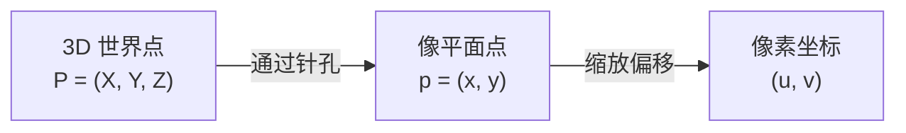
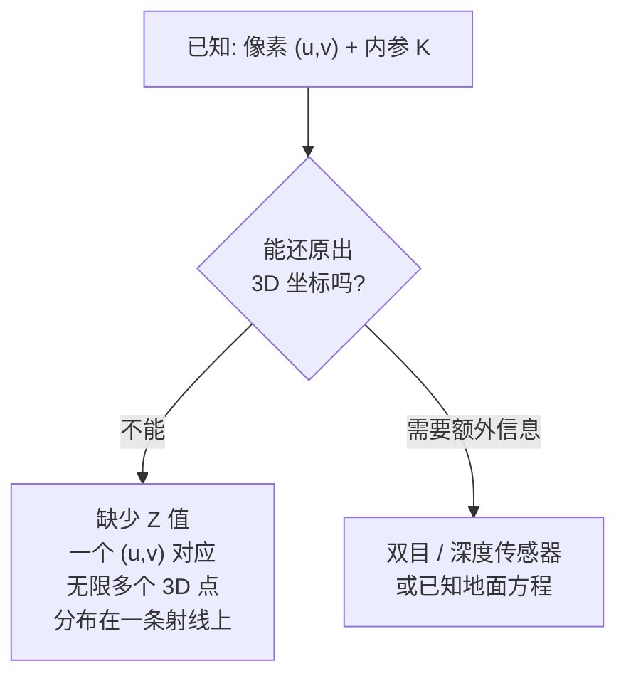
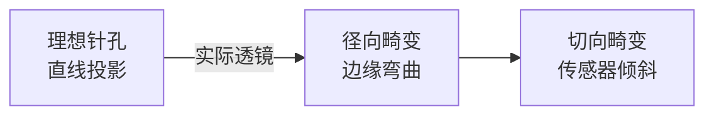
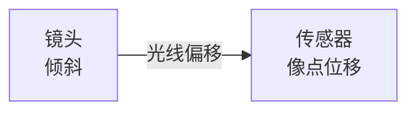
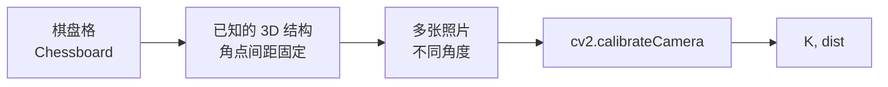
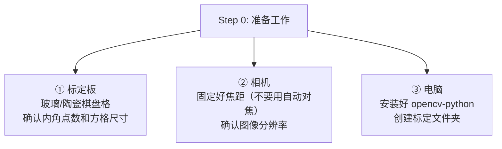
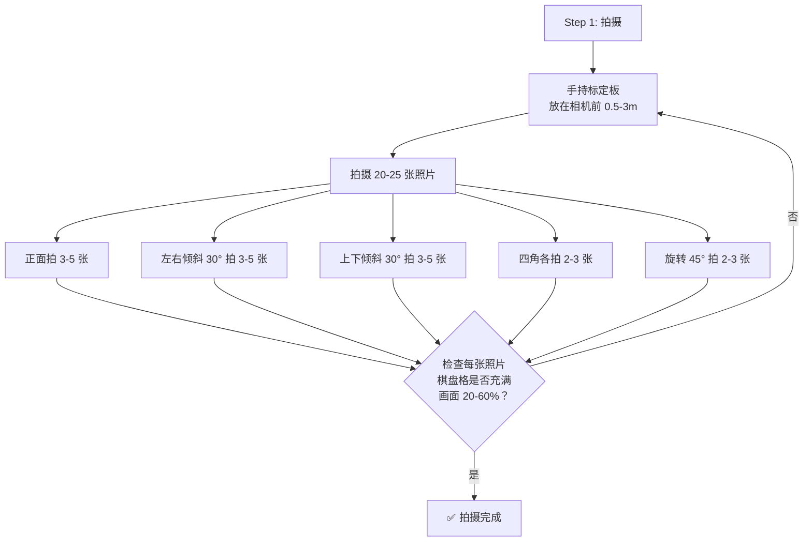
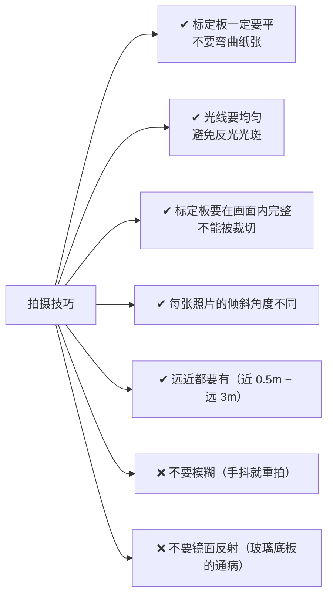
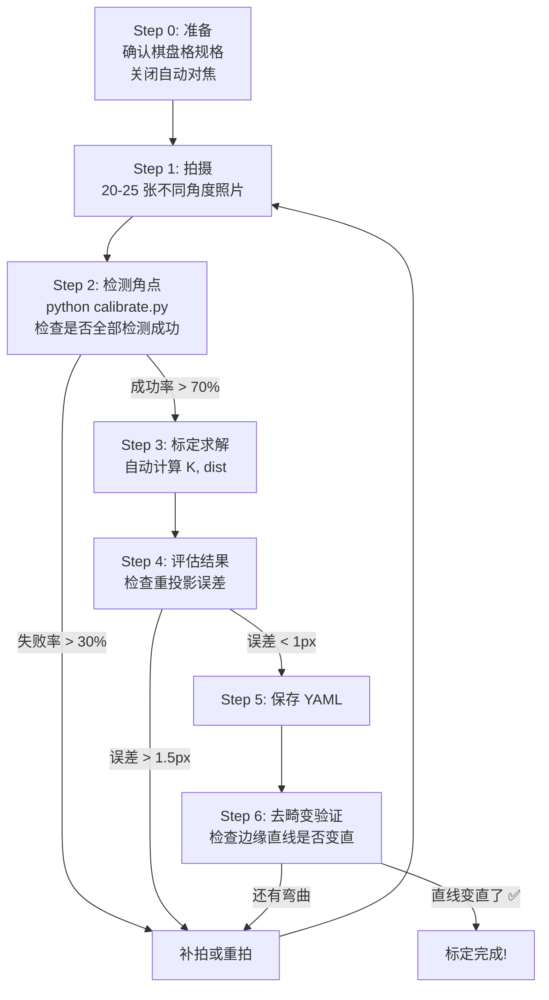
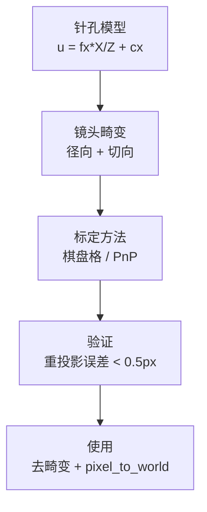

# 相机标定

## Phase 1：针孔相机模型

### 1.1 最简单的相机

针孔相机就是一个密闭盒子，一侧开一个小孔（光圈）：


**核心概念**：物体上每个点向各个方向发光，但只有穿过针孔的那一束光能到达传感器，形成一个清晰的（但倒立的）实像。

### 1.2 从针孔到数学



投影几何：


**相似三角形**（整个相机模型建立在此）：

```
x / f = X / Z    →    x = f × X / Z
y / f = Y / Z    →    y = f × Y / Z
```

这说明：**图像位置 (x,y) 只取决于 X/Z 和 Y/Z 的比值**，与绝对距离无关。一个远而大的物体和一个近而小的物体可能产生完全相同的图像。



### 1.3 从物理毫米到像素

传感器（CMOS）有物理像素。需要把毫米转换到像素：

```
u = fx × X/Z + cx
v = fy × Y/Z + cy
```

| 符号 | 含义 | 如何确定 |
|---|---|---|
| `fx` | x 方向的焦距（像素） | `fx = f × mx`，`mx` 是每毫米像素数 |
| `fy` | y 方向的焦距（像素） | `fy = f × my` |
| `cx` | 光心 x 偏移（像素） | 约为传感器宽度的一半 |
| `cy` | 光心 y 偏移（像素） | 约为传感器高度的一半 |

写成矩阵形式：

```
s × [u]     [fx  0  cx]   [X]
    [v]  =  [ 0  fy  cy] × [Y]
    [1]     [ 0   0   1]   [Z]
```

这个 3×3 矩阵 **K** 称为**相机内参矩阵**。

---

## Phase 2：镜头畸变

### 2.1 为什么会有畸变？

真实镜头不是完美针孔，它由多片玻璃组成，光线穿过时会弯曲：



### 2.2 径向畸变（Radial Distortion）

由镜头形状引起。靠近镜头边缘的光线弯曲程度比中心大。


数学模型：

```
x_distorted = x × (1 + k1×r² + k2×r⁴ + k3×r⁶)
y_distorted = y × (1 + k1×r² + k2×r⁴ + k3×r⁶)

其中 r² = x² + y²
```

| 系数 | 效果 |
|---|---|
| `k1` | 主要径向畸变（影响最大） |
| `k2` | 次要径向校正 |
| `k3` | 精细校正（大多数镜头为 0） |

### 2.3 切向畸变（Tangential Distortion）

由镜头与传感器平面不平行引起：



模型：

```
x_distorted += [2×p1×x×y + p2×(r² + 2×x²)]
y_distorted += [p1×(r² + 2×y²) + 2×p2×x×y]
```

### 2.4 畸变向量

OpenCV 将畸变系数合并为一个向量：

```python
dist_coeffs = [k1, k2, p1, p2, k3]
```

我们相机的示例：

```yaml
dist_coeffs: [-0.061883, 0.104794, 0.000434, -3.6e-05, 0.0]
#             [k1,       k2,       p1,      p2,      k3]
```

- **k1 = -0.062**：轻微桶形畸变（负值 = 桶形）
- **k2 = 0.105**：二级校正
- **p1, p2 ≈ 0**：切向畸变可忽略 → 镜头对准良好
- **k3 = 0**：不需要精细校正

### 2.5 畸变可视化


**效果**：图像边缘附近的直线会向外弯曲（桶形）或向内弯曲（枕形）。图像中心区域不受影响。

---

## Phase 3：标定原理

### 3.1 需要求解什么

需要找到：

```
K = [fx   0  cx]     以及   dist = [k1, k2, p1, p2, k3]
    [ 0  fy  cy]
    [ 0   0   1]
```

共 **9 个参数**（fx, fy, cx, cy, k1, k2, p1, p2, k3）。

### 3.2 标定物



使用棋盘格的原因：

```
1. 角点可以自动检测 → cv2.findChessboardCorners
2. 角点的 3D 位置已知 → 假设 Z=0 平面，X,Y 由方格大小确定
3. 多张照片提供足够的约束 → N 张照片 × M 个角点 > 需要求解的参数
```

### 3.3 标定的数学原理

每张照片提供一组对应关系：

```
3D 棋盘角点:     P_i = (X_i, Y_i, 0)         ← 已知（假设平面）
2D 图像像素:     p_i = (u_i, v_i)            ← 检测得到
每张照片的外参:   R_j, T_j                   ← 未知（每张不同）
全局内参:        K, dist                     ← 要找的
```

**每张照片**提供 `2 × M` 个方程（M = 角点数）：

```
每张照片的未知数: 6 个外参 (R_j, T_j)
全局未知数:       5 个内参 (fx, fy, cx, cy + dist)

N 张照片提供:     2 × M × N 个方程
未知数总数:       6 × N + 5

要求: 2 × M × N > 6 × N + 5
```

**典型配置**: M = 54（9×6 棋盘格），N = 15 张照片

```
方程数: 2 × 54 × 15 = 1620
未知数: 6 × 15 + 5 = 95
→ 超定系统 → 最小二乘求解
```

### 3.4 标定步骤

```python
import cv2
import numpy as np
import glob

# 1. 准备棋盘格 3D 点
cb_width, cb_height = 9, 6        # 内角点数
square_size = 30.0                 # 毫米

objp = np.zeros((cb_width * cb_height, 3), np.float32)
objp[:, :2] = np.mgrid[0:cb_width, 0:cb_height].T.reshape(-1, 2)
objp *= square_size                 # 单位: mm

# 2. 收集所有图片的角点
obj_points = []  # 3D 点
img_points = []  # 2D 像素

for fname in sorted(glob.glob("calib_images/*.jpg")):
    img = cv2.imread(fname)
    gray = cv2.cvtColor(img, cv2.COLOR_BGR2GRAY)

    # 检测角点
    ret, corners = cv2.findChessboardCorners(gray, (cb_width, cb_height), None)

    if ret:
        obj_points.append(objp)
        # 亚像素精化
        criteria = (cv2.TERM_CRITERIA_EPS + cv2.TERM_CRITERIA_MAX_ITER, 30, 0.001)
        corners_refined = cv2.cornerSubPix(gray, corners, (11, 11), (-1, -1), criteria)
        img_points.append(corners_refined)

        # 可视化验证
        cv2.drawChessboardCorners(img, (cb_width, cb_height), corners_refined, ret)

# 3. 标定求解
ret, K, dist, rvecs, tvecs = cv2.calibrateCamera(
    obj_points, img_points, gray.shape[::-1], None, None
)

print(f"重投影误差: {ret:.3f} px")  # < 0.5 表示良好
print(f"相机内参 K:\n{K}")
print(f"畸变系数:\n{dist.ravel()}")

# 4. 验证: 去畸变
img = cv2.imread("calib_images/test.jpg")
undistorted = cv2.undistort(img, K, dist)
cv2.imwrite("undistorted.jpg", undistorted)
```

### 3.5 结果解读

```yaml
# 良好标定（误差 < 0.5px）
camera_matrix:
  fx: 5033.78    # 焦距约 5000 像素
  fy: 5036.14
  cx: 2829.23    # 光心约在图像中心
  cy: 1929.49
dist_coeffs: [-0.062, 0.105, 0.0004, -0.00004, 0]
#              k1      k2     p1      p2      k3
```

**如何解读 fx：**

```
fx = f × mx
f  = 物理焦距 (mm)
mx = 像素密度 (pixels/mm)

如果传感器宽度 = 36mm，图像宽度 = 5472px:
  mx = 5472 / 36 = 152 pixels/mm
  f  = fx / mx = 5034 / 152 = 33.1mm
```

**重投影误差：**

```
< 0.3 px:  标定非常优秀
0.3 - 0.8: 良好标定（我们的目标）
0.8 - 1.5: 可接受，但需要更好的照片
> 1.5:     标定不合格，重新拍照
```

---

## Phase 4：全流程实操指南

### 4.1 准备工作



**需要确认的参数：**

```bash
# 查看棋盘格规格
# 例：12×9 格子 → 内角点 11×8
# 方格尺寸：25mm（问卖家或自己量）

# 相机设置
# 关闭自动对焦！关闭自动对焦！关闭自动对焦！
# 固定曝光、固定白平衡
```

**创建文件夹结构：**

```
project/
├── calib_images/          # 存放标定照片
│   ├── img_01.jpg
│   ├── img_02.jpg
│   └── ...
└── calib_result/          # 存放标定结果
    └── params.yaml
```

---

### 4.2 拍摄标定照片（最重要的一步）

#### 操作流程



#### 拍摄检查清单



#### 良好 vs 不合格照片对比

| 合格 ✅ | 不合格 ❌ |
|---|---|
| 标定板平整 | 标定板弯曲/折角 |
| 整个棋盘格都在画面内 | 边缘被裁切 |
| 清晰对焦 | 模糊/虚影 |
| 光照均匀 | 半边亮半边暗 |
| 棋盘格占画面 20-60% | 太小或太大 |

---

### 4.3 编写标定脚本

创建 `calibrate.py` 文件：

```python
#!/usr/bin/env python3
"""
相机标定脚本
用法: python calibrate.py

要求:
  - calib_images/ 目录下有标定照片
  - 已确认棋盘格内角点数和方格尺寸
"""

import cv2
import numpy as np
import glob
import os
import yaml

# ===== 配置 =====
CB_WIDTH = 11          # 内角点：横向个数 ← 改成你的棋盘格规格
CB_HEIGHT = 8          # 内角点：纵向个数
SQUARE_SIZE = 25.0     # 方格尺寸（mm）
IMAGE_DIR = "calib_images"
OUTPUT_DIR = "calib_result"

# ===== Step 1: 准备 3D 点 =====
print("=" * 50)
print("相机标定")
print("=" * 50)

objp = np.zeros((CB_WIDTH * CB_HEIGHT, 3), np.float32)
objp[:, :2] = np.mgrid[0:CB_WIDTH, 0:CB_HEIGHT].T.reshape(-1, 2)
objp *= SQUARE_SIZE

print(f"棋盘格规格: {CB_WIDTH}×{CB_HEIGHT} 内角点")
print(f"方格尺寸: {SQUARE_SIZE}mm")
print(f"照片目录: {IMAGE_DIR}/")

# ===== Step 2: 收集所有图片的角点 =====
obj_points = []  # 3D 点（所有照片）
img_points = []  # 2D 像素（所有照片）
image_files = sorted(glob.glob(f"{IMAGE_DIR}/*.jpg")) + \
              sorted(glob.glob(f"{IMAGE_DIR}/*.png"))
success_count = 0
fail_count = 0

for fname in image_files:
    img = cv2.imread(fname)
    gray = cv2.cvtColor(img, cv2.COLOR_BGR2GRAY)
    h, w = gray.shape

    # 检测角点
    ret, corners = cv2.findChessboardCorners(gray, (CB_WIDTH, CB_HEIGHT), None)

    if ret:
        # 亚像素精化
        criteria = (cv2.TERM_CRITERIA_EPS + cv2.TERM_CRITERIA_MAX_ITER, 30, 0.001)
        corners_refined = cv2.cornerSubPix(gray, corners, (11, 11), (-1, -1), criteria)

        obj_points.append(objp)
        img_points.append(corners_refined)
        success_count += 1

        # 可视化角点（保存结果方便检查）
        vis = img.copy()
        cv2.drawChessboardCorners(vis, (CB_WIDTH, CB_HEIGHT), corners_refined, ret)
        os.makedirs(f"{OUTPUT_DIR}/corners", exist_ok=True)
        cv2.imwrite(f"{OUTPUT_DIR}/corners/{os.path.basename(fname)}", vis)
        print(f"  ✅ {os.path.basename(fname)}: 检测到 {len(corners)} 个角点")
    else:
        fail_count += 1
        print(f"  ❌ {os.path.basename(fname)}: 未检测到角点")

print(f"\n检测结果: {success_count} 成功 / {fail_count} 失败 / {len(image_files)} 总计")

if success_count < 10:
    print("❌ 成功检测的照片太少（< 10 张），请重新拍摄")
    exit(1)

# ===== Step 3: 执行标定 =====
print("\n正在标定...")
ret, K, dist, rvecs, tvecs = cv2.calibrateCamera(
    obj_points, img_points, gray.shape[::-1], None, None
)

print(f"\n标定完成!")
print(f"重投影误差: {ret:.4f} 像素")
print(f"\n相机内参 K（像素单位）:")
print(f"  fx = {K[0,0]:.4f}")
print(f"  fy = {K[1,1]:.4f}")
print(f"  cx = {K[0,2]:.4f}")
print(f"  cy = {K[1,2]:.4f}")
print(f"\n畸变系数:")
print(f"  k1 = {dist[0,0]:.6f}")
print(f"  k2 = {dist[0,1]:.6f}")
print(f"  p1 = {dist[0,2]:.6f}")
print(f"  p2 = {dist[0,3]:.6f}")
print(f"  k3 = {dist[0,4]:.6f}")

# ===== Step 4: 评估结果 =====
print("\n" + "=" * 50)
print("精度评估")
print("=" * 50)

if ret < 0.5:
    print("✅ 标定非常优秀（误差 < 0.5px）")
elif ret < 0.8:
    print("✅ 标定良好（误差 < 0.8px）")
elif ret < 1.5:
    print("⚠️ 标定可接受（误差 < 1.5px），还可以改进")
else:
    print("❌ 标定误差过大（> 1.5px），建议重新拍摄")

# ===== Step 5: 保存结果 =====
os.makedirs(OUTPUT_DIR, exist_ok=True)

# 保存为 YAML（ROS2 格式）
result = {
    "/transform_node": {
        "ros__parameters": {
            "camera_matrix": K.flatten().tolist(),
            "dist_coeffs": dist.flatten().tolist(),
            "verbose": True
        }
    }
}

yaml_path = f"{OUTPUT_DIR}/params.yaml"
with open(yaml_path, "w", encoding="utf-8") as f:
    yaml.dump(result, f, default_flow_style=None, allow_unicode=True)
print(f"\n📁 YAML 文件已保存: {yaml_path}")

# 也保存为 NumPy 格式（方便 Python 读取）
np.savez(f"{OUTPUT_DIR}/calibration_result.npz",
         camera_matrix=K, dist_coeffs=dist,
         image_size=(w, h))
print(f"📁 NumPy 文件已保存: {OUTPUT_DIR}/calibration_result.npz")

# ===== Step 6: 去畸变验证 =====
print("\n正在生成去畸变验证图...")
test_files = sorted(glob.glob(f"{IMAGE_DIR}/*.jpg")) + \
             sorted(glob.glob(f"{IMAGE_DIR}/*.png"))

if test_files:
    test_img = cv2.imread(test_files[0])
    h, w = test_img.shape[:2]

    # 去畸变
    new_camera_matrix, roi = cv2.getOptimalNewCameraMatrix(K, dist, (w, h), 1, (w, h))
    undistorted = cv2.undistort(test_img, K, dist, None, new_camera_matrix)

    # 保存对比图
    compare = np.hstack([test_img, undistorted])
    cv2.imwrite(f"{OUTPUT_DIR}/undistort_compare.jpg", compare)
    print(f"📁 去畸变对比图: {OUTPUT_DIR}/undistort_compare.jpg")
    print("  左侧: 原始图像 | 右侧: 去畸变后")

    # 重投影误差可视化（取第一张照片）
    if len(obj_points) > 0 and len(img_points) > 0:
        projected_points, _ = cv2.projectPoints(
            obj_points[0], rvecs[0], tvecs[0], K, dist
        )
        vis_img = test_img.copy()
        for pt_orig, pt_proj in zip(img_points[0], projected_points):
            u_orig, v_orig = pt_orig[0]
            u_proj, v_proj = pt_proj[0]
            cv2.circle(vis_img, (int(u_orig), int(v_orig)), 3, (0, 255, 0), -1)  # 绿 = 检测点
            cv2.circle(vis_img, (int(u_proj), int(v_proj)), 3, (0, 0, 255), -1)  # 红 = 重投影
            cv2.line(vis_img, (int(u_orig), int(v_orig)), (int(u_proj), int(v_proj)), (0, 255, 255), 1)
        cv2.imwrite(f"{OUTPUT_DIR}/reprojection_check.jpg", vis_img)
        print(f"📁 重投影验证图: {OUTPUT_DIR}/reprojection_check.jpg")
        print("  绿色: 检测到的角点 | 红色: 重投影位置")

print("\n✅ 标定全部完成！")
```

---

### 4.6 步骤汇总



---

## Phase 5：验证方法

### 5.1 视觉验证

```python
# 标定前：
img = cv2.imread("raw.jpg")
# 检查图像边缘的直线是否弯曲
# 例如：场地边界线

# 去畸变后：
undistorted = cv2.undistort(img, K, dist)
# 直线应该变直
```

### 5.2 PnP 交叉验证

```
标定相机 → 得到 K, dist
用 PnP 配合已知 3D 点 → 得到 R, T
把 3D 点投影回 2D → 测量残差

如果标定准确：
    PnP 残差 < 5 像素 ✅

如果标定不准：
    PnP 残差 > 20 像素 ❌
    → 重新标定
```

### 5.3 快速现场检查

```
1. 站在场地一角，拍摄一张包含整个场地的照片
2. 用 undistort 去畸变
3. 观察场地边缘直线是否变直
4. 如果边缘还有弯曲 → 需要重新标定
```

---

## 总结



| 概念 | 核心要点 |
|---|---|
| 针孔模型 | 图像位置 = f × (X/Z)。Z 被丢失。 |
| 内参矩阵 K | fx, fy, cx, cy — 映射 3D → 2D 像素 |
| 畸变参数 | k1,k2（径向），p1,p2（切向）— 镜头缺陷 |
| 标定原理 | 棋盘格 + 多角度 → 最小二乘求解 |
| 重投影误差 | < 0.5px = 优秀；< 1px = 可接受 |

---

## Phase 6：IMU 介绍

### 6.1 IMU 的简单工作原理

**IMU**（Inertial Measurement Unit，惯性测量单元）是一个芯片级传感器，内部集成了**陀螺仪（Gyroscope）**和**加速度计（Accelerometer）**，分别测量三轴角速度与三轴加速度。

**陀螺仪的原理（科里奥利效应）**：内部有一个不停振动的微小质量块。当芯片旋转时，质量块会感受到一个垂直于振动方向的**科里奥利力**，这个力的大小与旋转角速度成正比。测量这个力引起的电容/位移变化，就能解算出绕各轴的**角速度**（rad/s）。

**加速度计的原理**：内部有一个"弹簧-质量块"结构。芯片加速或受重力时，质量块会相对壳体偏移，偏移量反映在电容变化上。测得的是**比力**——包含了重力分量和真实加速度，因此无法区分"在加速"与"在倾斜"（静止时测到的就是重力 g 的方向）。

> 关键点：陀螺仪给出的是**角速度**，要得到姿态角需要**对时间积分**；而积分会累积漂移（drift），所以通常用加速度计/磁力计来长期修正。

### 6.2 我们需要从 IMU 中获得的信息

在视觉自瞄系统中，IMU 主要是提供"相机/云台在当前空间里的运动状态"，用来**做坐标变换和动态补偿**。我们需要的信息有两类：

**① 角速度（Gyro）—— 用于云台/底盘运动补偿**

```
场景：云台正在转动时，目标在图像里的位置会随云台运动而偏移。
如果我们只知道"当前帧的像素坐标"，等子弹飞到时目标已经跑掉了。

用 IMU 角速度 (ω) 补偿：
  目标相对云台的角速度 = 目标在图像中的角速度 - IMU 测得的云台角速度
  → 预测子弹飞行时间 (TOF) 后目标的真实位置
```

这是自瞄最核心的一个用途：**用 IMU 角速度把"目标在图像里的移动"和"云台自己的转动"解耦**，从而只对目标真实运动做预测。

**② 姿态（Attitude：四元数 / 欧拉角）—— 用于坐标系变换**

```
像素坐标 (u,v)  → 相机坐标系 → 云台坐标系 → 世界坐标系

其中"相机坐标系 → 云台/世界坐标系"这一步的旋转关系，
需要相机相对重力方向（或云台基座）的姿态。

IMU 测到重力方向 → 得到相机当前俯仰(pitch)/横滚(roll)角
→ 把像素坐标系变换到云台/世界坐标系
```

我们通常直接使用的就是 IMU 的姿态四元数（或经过 EKF 融合后的姿态），把它作为**相机外参旋转部分**的动态来源。

**③ 加速度（Accelerometer）—— 用于重力方向基准**

主要用于获得重力的方向，作为姿态估计的长期修正，同时可辅助判断底盘/云台的加速状态。单独的加速度计噪声较大，一般不直接用于位置计算。

**总结**：

| 需要的信息 | 来源 | 用途 |
|---|---|---|
| 三轴角速度 ω | 陀螺仪 | 云台运动补偿、目标真实角速度解耦、TOF 预测 |
| 姿态（四元数/欧拉角） | 陀螺仪积分 + 加速度计修正（EKF 融合） | 相机坐标系到云台/世界坐标系的旋转变换 |
| 重力方向（加速度） | 加速度计 | 姿态估计基准、俯仰/横滚参考 |
