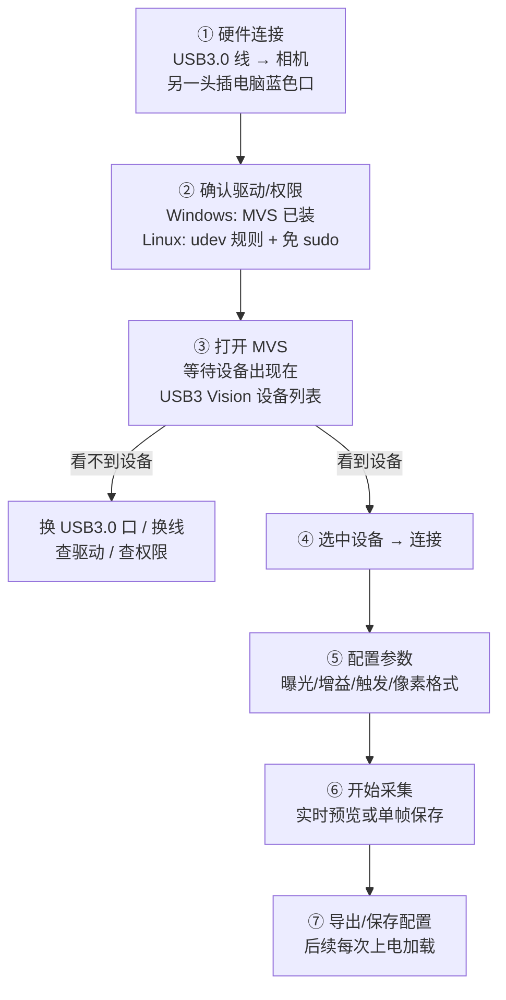

> 本文面向第一次接触工业相机的视觉组成员。：**主要是了解相机参数的调节，以及MVS和SDK**。

---

## 0. 整体认识

在 RoboMaster 视觉系统里，相机处于整条数据链的最上游：

```text
工业相机 → 图像 → 目标检测 → 位姿解算 → 目标状态估计 → 弹道解算 → 云台控制
```

相机输出的图像质量直接决定下游所有算法能看到什么。本文把这一段的"相机侧"讲清楚：

```text
镜头 → CMOS 感光 → 相机电路 → 数据接口 → 上位机(USB3.0) → SDK → 你的代码 → cv::Mat
```


---

# 第一部分：工业相机与镜头的硬件基础

## 1. 工业相机和普通相机的区别

| 对比项 | 手机摄像头 | 工业相机 |
| --- | --- | --- |
| 参数可控性 | 曝光/白平衡/增益由算法自动决定，随时在变 | 所有参数可手动锁定，设定后长期不变 |
| 最大帧率 | 一般偏低 | 中端相机即可达到 200~800+ FPS(与分辨率和接口也有关) |
| 快门方式 | 多数为卷帘快门 | 常见全局快门 |
| 触发方式 | 无外触发 | 支持外触发/软触发/连续采集 |
| 数据接口 | 内部接口，直接进手机 SoC | 标准化的 GigE / USB3.0 等接口，直接进电脑 |
| 数据格式 | 通常被压缩处理过 | 可直接输出裸数据（Mono8 / RGB8 / Bayer） |

其中最关键的一条是**参数可控且固定**：

- **可控**：曝光时间、增益、白平衡都可以由你精确指定；
- **固定**：设定之后不会因为环境明暗变化而自动改变。

对比一下手机：当你从暗房间走到亮处，手机画面会"突然变亮然后又慢慢压暗"，这是它在自动调曝光和感光度。这对拍照是便利，对视觉算法却是不利的——**同一个装甲板，上一帧过曝、下一帧欠曝，算法阈值怎么写都稳不住**。

工业相机把光圈、焦距、曝光、增益全部锁死后，得到的图像是"确定性的"：同样的光照下，同一时刻的曝光与响应永远一致。这也让相机内参（焦距、光心、畸变）保持稳定，是后续相机标定和位姿解算能成立的前提。

## 2. 硬件结构介绍

广义上的"相机"由两部分组成，两者可以分开选型、更换：


- **相机头（Camera Head）**：核心是 CMOS / CCD 感光元件。光落在感光元件上，转换为电荷，经电路放大、模数转换，最终通过数据接口发送给电脑。我们平时说的"相机参数"，大部分是这一部分的参数。
- **镜头（Lens）**：一组光学镜片，负责把远处物体的光正确汇聚到感光元件上。它决定你"看得到多远、看多大范围、看得多清楚"。

两者的搭配关系很关键：镜头的光学像面必须覆盖相机头传感器的靶面（传感器尺寸），且法兰距要与接口匹配，否则画面会有暗角或无法对焦。

## 3. 相机头：把光信号转换为数字信号

相机头内部的信号流大致是：

```text
光 → CMOS 感光元件(光子→电荷) → 模拟放大 → ADC(模数转换) → ISP(可选) → 数据接口 → 电脑
```

- **感光元件**：目前主流是 CMOS。每个像素是一个感光单元，光子照在上面产生电荷，电荷量对应光的强度。
- **数据接口**：决定传输带宽和连接方式，常见的如下：

| 接口 | 带宽 | 特点 | 备注 |
| --- | --- | --- | --- |
| GigE（千兆网） | 1 Gbps | 传输距离长、易组网 | RM 中很常见，需设置 IP |
| USB 3.0 | ~5 Gbps | 即插即用、带宽大 | 线长受限（一般 <3m） |
| Camera Link | 可达数 Gbps | 高带宽高稳定 | 需专用采集卡 |
| CoaXPress | 更高 | 工业高端 | 成本高 |

对 RM 而言，**GigE 和 USB 3.0 是主流**。本文后续以海康 **USB3.0相机** 为例介绍连接流程。

## 4. 镜头

### 4.1 焦距与视场角

镜头最重要的参数是**焦距**（Focal Length，单位 mm）。

- 焦距长 → 看得远、看得清远处细节，但视野窄；
- 焦距短 → 视野广，但远处的目标占的像素少。

视野大小用**视场角（FOV, Field of View）** 描述。已知传感器宽度 W 和焦距 f 时，水平视场角为：

```
α = 2 × arctan( W / (2f) )
```

其中 `W` 是传感器**宽度**。传感器**高度** 对应垂直视场角 VFOV，传感器**对角线** 对应对角视场角 DFOV。

选镜头时，视野不是越大越好：视野过大，目标占的像素少，远处装甲板特征不足；视野过小，目标又可能出画。这是"选多大焦距"的权衡。

### 4.2 光圈

光圈控制进光量，用 F 值表示（如 F1.4、F2.0、F8.0）。

> **F 值数字越小，光圈开得越大，进光越多。**

镜头上的**光圈环** 就是物理转动它来调节进光量。光圈还影响景深：大光圈景深浅（背景容易虚化），小光圈景深大。

在 RM 里，因为曝光时间往往调得很短（几千微秒），为了保证图像亮度足够，实车上一般把光圈直接开得比较大，让光线尽量在短时间内打满感光元件。

### 4.3 对焦环、光圈环与变焦环

一颗典型的工业定焦镜头上通常有两个环：

| 环 | 作用 |
| --- | --- |
| **对焦环** | 调节镜组位置，让成像平面恰好落在感光元件上（画面清晰）。焦距固定的镜头也需要对焦 |
| **光圈环** | 调节进光量大小 |

变焦镜头（如单反 18-55mm 这类）还会多一个**变焦环**，用于改变焦距。变焦之后成像平面位置会变，因此**每变一次焦都要重新对焦**。

> 对焦是拿到相机只后需要做的：对着算法所针对的目标距离，拧对焦环直到图像最锐利，然后用胶带/锁紧螺丝固定。之后最好不要再动它。

### 4.4 镜头接口：C 口与 CS 口

镜头和相机头之间的机械接口要匹配，最常见的是：

- **C 口**：法兰距 17.526 mm；
- **CS 口**：法兰距 12.526 mm，相差一个 5 mm 转接环。

CS 口相机装 C 口镜头时需要加转接环，否则无法在无穷远合焦。

---

# 第二部分：相机参数说明

> 了解这些参数，一方面是为了读懂相机数据手册完成选型，另一方面是连接上相机后知道"该调什么、为什么这么调"。

## 5. 传感器相关参数

### 5.1 分辨率

分辨率 = 传感器水平 × 垂直方向的像素个数，例如 1280×1024。

- 分辨率越高，图像越清晰、能看到的细节越多；
- 但**不是越高越好**：数据量大、算法处理负担重、帧率通常更低。

选型原则：分辨率满足"目标在算法要求的最远距离上仍保留足够像素"即可，不要盲目追高。例如自瞄主相机往往用 1280×1024 左右、高帧率优先。

### 5.2 传感器尺寸

传感器靶面尺寸，常见规格如下（有效面积）：

| 型号 | 有效面积 宽×高（mm） |
| --- | --- |
| 1/4″ | 3.2 × 2.4 |
| 1/3″ | 4.8 × 3.6 |
| 1/2″ | 6.4 × 4.8 |
| 2/3″ | 8.8 × 6.6 |
| 1″ | 12.8 × 9.6 |

传感器尺寸决定镜头像面要覆盖多大。同一分辨率下，传感器越大、像元通常越大、感光越好。

### 5.3 像元尺寸

单个像素的物理尺寸（如 3.45 μm、4.8 μm）。

- 像元小 → 单位面积像素多、分辨率高，利于检测细小缺陷；
- 但像元越小，满阱容量越小（能存的电荷少），**动态范围降低**、暗光下噪声更容易显现。

### 5.4 像素深度

每个像素用多少 bit 表示亮度。8 bit 表示 0~255 共 256 级灰度；16 bit 能表示 65536 级。bit 数越多，亮度分级越细，图像越细腻，但数据量翻倍。

> 注意：像素深度 ≠ 分辨率。它描述的是"每个像素的明暗分级精度"。

### 5.5 动态范围

传感器能同时分辨的最亮与最暗的比值。动态范围大 → 强光和阴影部分的细节能同时保留；动态范围小 → 亮部/暗部容易"死白/死黑"。

## 6. 曝光与快门

### 6.1 曝光时间

曝光时间就是感光元件"开门"接收光的时间，单位通常为**微秒（μs）**，如 2000 μs = 2 ms。

- 曝光时间越长，进光越多、图像越亮，但运动目标越容易**拖影**；
- 曝光时间越短，图像越暗，但能"冻结"高速运动。

在 RM 中曝光时间还直接决定了帧率上限：

```text
帧率上限 ≈ 1 / 曝光时间
例如 2000 μs（2 ms）→ 理论上限约 500 FPS
```

这也是为什么追逐高帧率（如 860 FPS）时必须把曝光压到 1000 μs 左右。曝光太短图像会很暗，所以又要靠大光圈和增益补偿——**这几个参数永远在互相拉扯**。

### 6.2 全局快门 vs 卷帘快门

这是 RM 选相机**必须理解** 的一组概念：

| 快门方式 | 曝光方式 | 问题 |
| --- | --- | --- |
| **全局快门（Global Shutter）** | 所有像素同一时刻同时曝光 | 无果冻效应，适合高速运动 |
| **卷帘快门（Rolling Shutter）** | 逐行依次曝光 | 高速运动时产生"果冻效应" |

手机相机大多是卷帘快门。想象你在高铁上拍窗外的电线杆：电线杆在画面里是**斜的、弯的**，因为每一行曝光的时间点不同，而场景在高速运动。

机器人上相机和敌方都在高速运动，图像"变形"会直接毁掉检测和测距，因此**自瞄相机必须选全局快门**。

### 6.3 增益（Gain）

对感光信号做放大。增益越大图像越亮，但**噪声也会被一起放大**，图像变"脏"。

调光顺序的一般思路：**先开大光圈 → 再延长曝光 → 最后才加增益**。增益是"最后的手段"，尽量不加。

### 6.4 白平衡

彩色相机的三通道（R/G/B）增益系数。白平衡不对，白色物体拍出来会偏色，直接影响颜色分割（灯条提取）。固定光源下应关闭自动白平衡，手动设定一组系数并锁死。

## 7. 采集模式（触发方式）

工业相机一般支持三种采集模式：

| 模式 | 工作方式 | 用途 |
| --- | --- | --- |
| **连续采集** | 相机内部持续曝光出图 | 调试、地面站实时预览 |
| **软触发** | 软件发指令，相机才曝光一帧 | 按需取帧，但时延较大 |
| **外触发（硬件触发）** | 外部 I/O 收到脉冲信号才曝光 | RM 比赛首选，对齐时间戳 |

比赛里为什么用**外触发**？因为云台/主控可以给相机发一个固定频率的脉冲，让**图像采集时刻和陀螺仪/IMU 采样时刻尽量对齐**，后续做运动补偿、弹道预测时数据是同一时刻的。软触发由于要走"软件发指令→电路→传输"整条链路，时延最大、最不稳定。

## 8. 其他常用概念

- **伽马曲线 / Gamma**：对亮度做非线性映射，让画面更符合人眼观感。工业算法一般用默认值，不建议为了"好看"乱调。
- **像素格式（Pixel Format）**：Mono8（灰度）、RGB8（彩色）、BayerRG8（拜耳原始）等。彩色相机输出的是 Bayer 格式时，需要做去马赛克（debayer）转成 RGB，SDK 或 OpenCV 都提供转换。
- **光谱响应**：传感器对不同波长光的敏感度，选灯/选相机时参考，日常开发基本不用管。

## 9. 一次调参的思路

拿到车上的相机，一套比较合理的初始化流程：

```text
1. 确定场景：白天/晚上、是否开灯条，先决定大致曝光量级
2. 光圈固定到最大（F1.4 附近），不再动
3. 拧对焦环，让目标最清晰，锁死
4. 在 MVS/SDK 里设曝光（比如从 2000 μs 起步），观察画面亮度
5. 曝光不足再加增益，曝光合适就尽量不开增益
6. 关自动白平衡，手动校准白平衡
7. 全部参数确认后，存成配置，每次上电自动加载
```

> 核心原则：**先把画面调"确定"，再去调算法。** 画面参数不稳定，后面所有特征阈值都是空中楼阁。

---

# 第三部分：MVS —— 连接相机的软件与操作顺序

## 10. MVS：机器视觉软件

**MVS（Machine Vision Software）** 是海康机器视觉出品的工业相机配套软件，也是我们队里使用的相机调试工具。MVS 同时包含两样东西：

1. **MVS 客户端（上位机软件）**：图形界面，用于连接相机、实时预览、调参数、存图存配置；
2. **MVS SDK**：面向开发者的开发包，包含头文件、动态库、示例代码和文档，供我们写 C++/C#/Python 程序调用。

所以流程是：先用 **MVS 客户端** 把相机连上、把参数调好；再用 **SDK** 在自己的程序里复现同一套参数并取流。两者用的是同一套参数体系。

> 不同厂商的同类工具叫法不同（如迈德威视 SDK、大恒 Galaxy 软件），但"客户端调参 + SDK 开发"的思路完全一致。

## 11. 安装 MVS

从海康机器人官网的"机器视觉 → 下载中心"下载对应平台的 MVS（Windows / Linux）。安装注意：

- Windows：一路默认安装即可，安装过程中会为 USB 相机注册 **USB3 Vision 驱动**；
- Linux：解压后运行 `setup.sh`，需要 `sudo`；安装后会自动配置 udev 规则，让普通用户也能访问 USB 相机。

## 12. 连接相机：USB 3.0 相机的完整操作顺序

### 12.1 USB 3.0 相机的"即插即用"原理

和 GigE 网口相机不同，USB3.0 相机**不需要配置 IP**：USB 由主机（Host）直接管理，插上电脑后系统会自动枚举出这个设备，MVS 就能发现它。

但它有两个前提：

1. **必须插在 USB 3.0 口上**：USB 3.0 接口内部是蓝色（或有 SS / SuperSpeed 标志），带宽约 5 Gbps；插到 USB 2.0 口虽然能识别，但带宽掉到 480 Mbps，高分辨率高帧率会直接顶不住；
2. **驱动/权限必须就绪**：Windows 上由 MVS 安装时注册驱动；Linux 上需要 udev 规则（见下）。

### 12.2 完整连接流程



**第 ① 步：确认用的是 USB 3.0 接口**

- 优先插在**机箱后面板** 的主板原生 USB 3.0 口（蓝色 / SS 标志）；
- **不要经过 USB Hub**（尤其无源 Hub），带宽会被共享和削弱。

**第 ② 步：Linux 下让普通用户能访问相机**

USB 设备默认只有 `root` 才能访问，不配置权限时跑程序经常报"没有权限"。MVS 安装脚本一般会自动写入 udev 规则，验证和手动补救方法如下：

```bash
# 查看相机对应的设备
lsusb

# 确认 MVS 生成的 udev 规则是否存在
ls /etc/udev/rules.d/ | grep -i hik

# 如果缺失，给相机所在 vid/pid 放开读写权限
echo 'SUBSYSTEM=="usb", ATTR{idVendor}=="xxxx", MODE="0666"' \
    | sudo tee /etc/udev/rules.d/99-hik-usb.rules

# 重载规则并重新插拔相机
sudo udevadm control --reload-rules
```

> 快速验证是不是权限问题：`sudo ./你的程序`。用 sudo 能打开、普通用户打不开，就是 udev 规则的问题。

**第 ③ 步：MVS 里看到设备**

打开 MVS，左侧"设备列表"会出现 **USB3 Vision** 设备。插好线却看不到，按优先级排查：

| 现象 | 排查项 |
| --- | --- |
| 设备列表为空 | 是否插在蓝色 USB3.0 口？换个口试试 |
| 设备列表为空 | 换一根 USB3.0 线（线材质量差异很大） |
| 设备列表为空 | Windows 看"设备管理器"驱动是否正常；Linux 查 udev / 先用 sudo 验证 |
| 显示"不可用/被占用" | 相机已被其他程序（如另一个 MVS 实例）打开，先关闭它 |
| 画面卡顿/掉帧 | 确认工作在全速模式，不要经过 USB Hub |

## 13. 在 MVS 里完成一次典型采集

连接成功后的常用操作顺序：

1. **连接设备**：设备列表里双击或右键 →"连接"；
2. **看实时画面**：点击"开始采集"，此时是连续采集模式，画面实时刷新；
3. **调参数**：在"相机参数"面板设置曝光时间、增益、触发模式、像素格式等，画面会即时反馈；
4. **存单帧/录像**：抓拍当前帧保存为图片，或录制视频用于离线调试；
5. **保存配置**：把调好的参数存为用户配置，之后程序或 MVS 可直接加载——**这是关键一步**，保证每次上电画面一致。

> 调好的参数尽量用 **SDK 在代码里显式设置一遍**，不要依赖 MVS 客户端记忆配置。这样换电脑、换相机、换环境后程序依然行为一致。

## 14. 常见问题速查

- **`MVS` 枚举不到相机**：先确认插的是蓝色 USB3.0 口；换一根 USB3.0 线；重启 MVS；Linux 下检查 udev 规则，或先用 `sudo` 验证是不是权限问题。
- **触发模式切到外触发后画面不动了**：这是正常的，外部没有脉冲信号相机就不曝光。调试时先切回"连续采集"。
- **画面暗**：加大曝光 → 加增益 → 开大光圈，按这个优先级调。
- **画面亮但有拖影**：曝光太长，缩短曝光时间（必要时补光圈/增益）。

---

# 第四部分：SDK

## 15. SDK 的概念

**SDK = Software Development Kit，软件开发工具包。**

字面拆解：

- **Software**：针对某个硬件（比如相机）或平台；
- **Development Kit**：帮助"开发"这件事的一组"工具"。

厂商为什么要给你 SDK？因为工业相机底层涉及 USB/网口协议、寄存器读写、图像缓冲管理，这些轮不到每个用户自己写。厂商把底层封装好，对外暴露一组**函数（API）**，再附上**文档** 和**示例代码**，就组成了一个 SDK。


**关键认识**：

1. **头文件（Include）** 告诉你"有哪些函数可以调、参数是什么"；
2. **库（Libraries）** 才是函数真正的实现，编译和运行时必须链接到它；
3. **示例（Samples）** 是官方帮你写好的最小可用代码，学习顺序上"**先跑通示例，再改示例，最后才自己写**"；
4. SDK 是很多的接口——它和 OpenCV 一样，本质是"头文件 + 库 + 文档 + 示例"四件套，你的工作就是按它的调用规则组合起来。

## 17. 小结

```text
MVS 客户端：连相机、调参数、存配置（人机交互）
MVS SDK：在你的代码里复现同一套参数并持续取流
调用：跑通 Sample → 改 Sample → 按生命周期封装 → 异常处理
```

- 本文对应的硬件与参数部分，是"看懂相机在做什么"；
- MVS 部分，是"把相机连上、调好"；
- SDK 部分，是"把相机搬进你的代码里"。

拿到图像之后，就进入 OpenCV 的领域（见文档 09）；相机能成像、能取流之后，下一步就是相机标定，用标定得到的内参把像素坐标和三维空间联系起来（见文档 11 的成像模型）。

---

## 学习参考：文档与视频

本文内容综合自以下资料，建议配合阅读、视频观看加深理解：

| 类型 | 名称 | 链接 | 覆盖内容 |
| --- | --- | --- | --- |
| 文章 | 工业相机常见参数（AomanHao · CSDN） | https://blog.csdn.net/Aoman_Hao/article/details/105170139 | 分辨率、传感器尺寸、像元尺寸、像素深度、动态范围、帧率、曝光方式、采集模式、增益等相机参数的系统讲解 |
| 文章 | RM 教程 4 —— 相机（Harry's Blog） | https://harry-hhj.github.io/posts/RM-Tutorial-4-Camera/ | 相机与镜头结构、成像模型、畸变、相机标定，以及 FOV 计算 |
| 视频 | 火锅战队 2023 视觉培训 4：工业相机 & SLAM 基础 | https://www.bilibili.com/video/BV1gc411N7QB/ | 工业相机参数、硬件与使用思路的实战讲解，比较直观 |
