> 本文回答自瞄里三个递进的问题：**"像素坐标是怎么来的"**（模块一：成像与标定）、**"空间中的旋转如何表示"**（模块二：旋转的四种表述）、**"从二维像素反推三维位姿"**（模块三：PnP）。


---

# 模块一：小孔成像几何、相机畸变与标定实战

## 1.1 针孔相机模型

### 1.1.1 最简单的相机

针孔相机就是一个密闭盒子，一侧开一个小孔（光圈）：

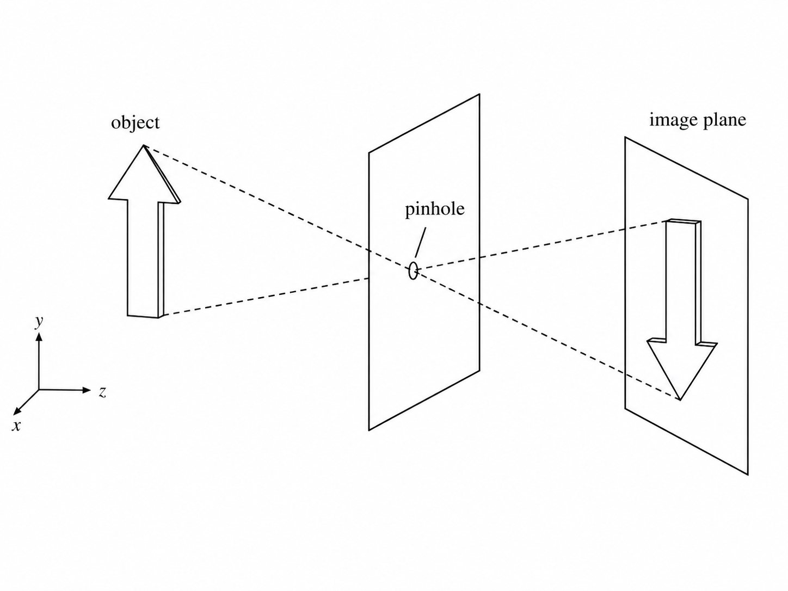

**核心概念**：物体上每个点向各个方向发光，但只有穿过针孔的那一束光能到达传感器，形成一个清晰的（但倒立的）实像。

### 1.1.2 从针孔到数学

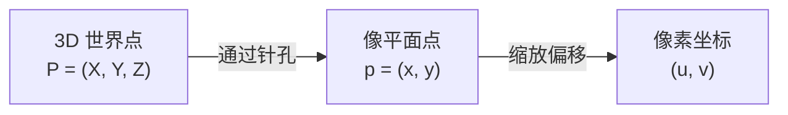

投影几何：

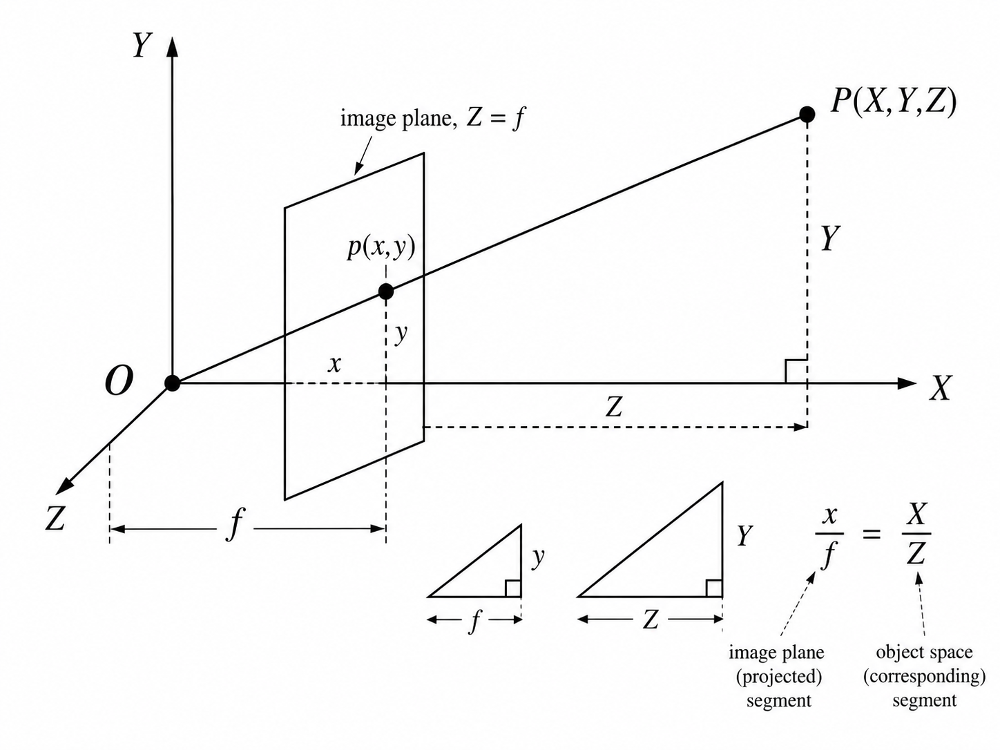

**相似三角形**（整个相机模型建立在此）：

$$ \frac{x}{f} = \frac{X}{Z} \;\Rightarrow\; x = f\,\frac{X}{Z}, \qquad \frac{y}{f} = \frac{Y}{Z} \;\Rightarrow\; y = f\,\frac{Y}{Z} $$

这说明：**图像位置 $(x,y)$ 只取决于 $X/Z$ 和 $Y/Z$ 的比值**，与绝对距离无关。一个远而大的物体和一个近而小的物体可能产生完全相同的图像。

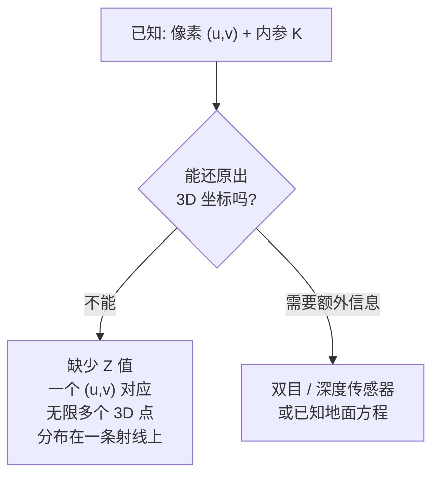

### 1.1.3 从物理毫米到像素

传感器（CMOS）有物理像素。需要把毫米转换到像素：

$$ u = f_x\,\frac{X}{Z} + c_x, \qquad v = f_y\,\frac{Y}{Z} + c_y $$

| 符号 | 含义 | 如何确定 |
|---|---|---|
| $f_x$ | $x$ 方向的焦距（像素） | $f_x = f \times m_x$，$m_x$ 是每毫米像素数 |
| $f_y$ | $y$ 方向的焦距（像素） | $f_y = f \times m_y$ |
| $c_x$ | 光心 $x$ 偏移（像素） | 约为传感器宽度的一半 |
| $c_y$ | 光心 $y$ 偏移（像素） | 约为传感器高度的一半 |

写成矩阵形式：

$$ s \begin{bmatrix} u \\ v \\ 1 \end{bmatrix} = \begin{bmatrix} f_x & 0 & c_x \\ 0 & f_y & c_y \\ 0 & 0 & 1 \end{bmatrix} \begin{bmatrix} X \\ Y \\ Z \end{bmatrix} $$

这个 3×3 矩阵 $K$ 称为**相机内参矩阵**。

---

## 1.2 镜头畸变

### 1.2.1 畸变的来源

真实镜头不是完美针孔，它由多片玻璃组成，光线穿过时会弯曲：

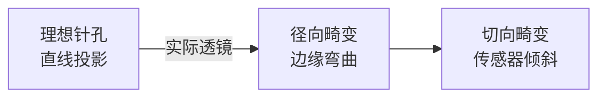

### 1.2.2 径向畸变（Radial Distortion）

由镜头形状引起。靠近镜头边缘的光线弯曲程度比中心大。

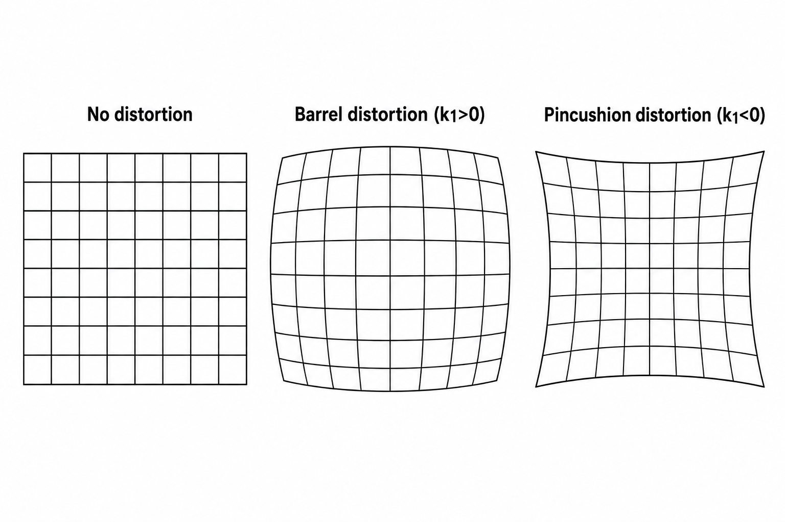

数学模型（$r^2 = x^2 + y^2$）：

$$ x_{\text{distorted}} = x \left(1 + k_1 r^2 + k_2 r^4 + k_3 r^6\right), \qquad y_{\text{distorted}} = y \left(1 + k_1 r^2 + k_2 r^4 + k_3 r^6\right) $$

| 系数 | 效果 |
|---|---|
| $k_1$ | 主要径向畸变（影响最大） |
| $k_2$ | 次要径向校正 |
| $k_3$ | 精细校正（大多数镜头为 0） |

### 1.2.3 切向畸变（Tangential Distortion）

由镜头与传感器平面不平行引起：

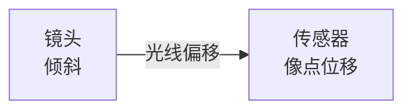

模型：

$$ x_{\text{distorted}} \mathrel{+}= 2p_1 xy + p_2 \left(r^2 + 2x^2\right), \qquad y_{\text{distorted}} \mathrel{+}= p_1 \left(r^2 + 2y^2\right) + 2p_2 xy $$

### 1.2.4 畸变向量

OpenCV 将畸变系数合并为一个向量：

```python
dist_coeffs = [k1, k2, p1, p2, k3]
```

我们相机的示例：

```yaml
dist_coeffs: [-0.061883, 0.104794, 0.000434, -3.6e-05, 0.0]
#             [k1,       k2,       p1,      p2,      k3]
```

- **$k_1 = -0.062$**：轻微桶形畸变（负值 = 桶形）
- **$k_2 = 0.105$**：二级校正
- **$p_1, p_2 \approx 0$**：切向畸变可忽略 → 镜头对准良好
- **$k_3 = 0$**：不需要精细校正

### 1.2.5 畸变可视化

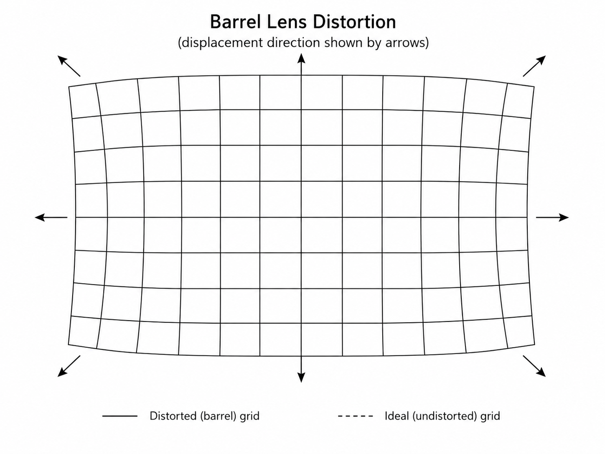

**效果**：图像边缘附近的直线会向外弯曲（桶形）或向内弯曲（枕形）。图像中心区域不受影响。

---

## 1.3 标定原理

### 1.3.1 需要求解什么

需要找到内参矩阵 $K$ 与畸变向量 $\text{dist}$：

$$ K = \begin{bmatrix} f_x & 0 & c_x \\ 0 & f_y & c_y \\ 0 & 0 & 1 \end{bmatrix}, \qquad \text{dist} = \left[ k_1, k_2, p_1, p_2, k_3 \right] $$

共 **9 个参数**（$f_x, f_y, c_x, c_y, k_1, k_2, p_1, p_2, k_3$）。

### 1.3.2 标定物

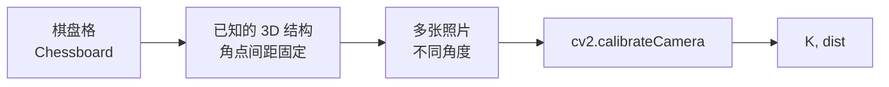

使用棋盘格的原因：

```
1. 角点可以自动检测 → cv2.findChessboardCorners
2. 角点的 3D 位置已知 → 假设 Z=0 平面，X,Y 由方格大小确定
3. 多张照片提供足够的约束 → N 张照片 × M 个角点 > 需要求解的参数
```

### 1.3.3 标定的数学原理

每张照片提供一组对应关系：

```
3D 棋盘角点:     P_i = (X_i, Y_i, 0)         ← 已知（假设平面）
2D 图像像素:     p_i = (u_i, v_i)            ← 检测得到
每张照片的外参:   R_j, T_j                   ← 未知（每张不同）
全局内参:        K, dist                     ← 要找的
```

**每张照片** 提供 $2M$ 个方程（$M$ = 角点数）：

```
每张照片的未知数: 6 个外参 (R_j, T_j)
全局未知数:       5 个内参 (fx, fy, cx, cy + dist)

N 张照片提供:     2 × M × N 个方程
未知数总数:       6 × N + 5

要求: 2 × M × N > 6 × N + 5
```

**典型配置**: $M = 54$（9×6 棋盘格），$N = 15$ 张照片

```
方程数: 2 × 54 × 15 = 1620
未知数: 6 × 15 + 5 = 95
→ 超定系统 → 最小二乘求解
```

### 1.3.4 标定步骤

```python
import cv2
import numpy as np
import glob

# 1. 准备棋盘格 3D 点
cb_width, cb_height = 9, 6        # 内角点数
square_size = 30.0                 # 毫米

objp = np.zeros((cb_width * cb_height, 3), np.float32)
objp[:, :2] = np.mgrid[0:cb_width, 0:cb_height].T.reshape(-1, 2)
objp *= square_size                 # 单位: mm

# 2. 收集所有图片的角点
obj_points = []  # 3D 点
img_points = []  # 2D 像素

for fname in sorted(glob.glob("calib_images/*.jpg")):
    img = cv2.imread(fname)
    gray = cv2.cvtColor(img, cv2.COLOR_BGR2GRAY)

    # 检测角点
    ret, corners = cv2.findChessboardCorners(gray, (cb_width, cb_height), None)

    if ret:
        obj_points.append(objp)
        # 亚像素精化
        criteria = (cv2.TERM_CRITERIA_EPS + cv2.TERM_CRITERIA_MAX_ITER, 30, 0.001)
        corners_refined = cv2.cornerSubPix(gray, corners, (11, 11), (-1, -1), criteria)
        img_points.append(corners_refined)

        # 可视化验证
        cv2.drawChessboardCorners(img, (cb_width, cb_height), corners_refined, ret)

# 3. 标定求解
ret, K, dist, rvecs, tvecs = cv2.calibrateCamera(
    obj_points, img_points, gray.shape[::-1], None, None
)

print(f"重投影误差: {ret:.3f} px")  # < 0.5 表示良好
print(f"相机内参 K:\n{K}")
print(f"畸变系数:\n{dist.ravel()}")

# 4. 验证: 去畸变
img = cv2.imread("calib_images/test.jpg")
undistorted = cv2.undistort(img, K, dist)
cv2.imwrite("undistorted.jpg", undistorted)
```

### 1.3.5 结果解读

内参矩阵 $K$ 按行展开存储：

```yaml
# 良好标定（误差 < 0.5px）
camera_matrix: [5033.78, 0.0,    2829.23,
                0.0,    5036.14, 1929.49,
                0.0,    0.0,     1.0]      # K 按行展开（3×3）
dist_coeffs: [-0.062, 0.105, 0.0004, -0.00004, 0]
#              k1      k2     p1      p2      k3
```

对应的 $K$：

$$ K = \begin{bmatrix} 5033.78 & 0 & 2829.23 \\ 0 & 5036.14 & 1929.49 \\ 0 & 0 & 1 \end{bmatrix} $$

**如何解读 $f_x$：**

$$ f_x = f \times m_x, \qquad f = \text{物理焦距(mm)}, \qquad m_x = \text{像素密度(pixels/mm)} $$

如果传感器宽度 = 36mm，图像宽度 = 5472px：

$$ m_x = \frac{5472}{36} = 152\ \text{pixels/mm}, \qquad f = \frac{f_x}{m_x} = \frac{5034}{152} = 33.1\ \text{mm} $$

**重投影误差：**

```
< 0.3 px:  标定非常优秀
0.3 - 0.8: 良好标定（我们的目标）
0.8 - 1.5: 可接受，但需要更好的照片
> 1.5:     标定不合格，重新拍照
```

---

## 1.4 全流程实操指南

### 1.4.1 准备工作

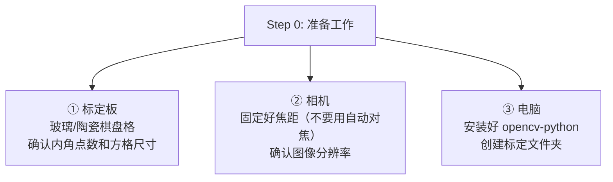

**需要确认的参数：**

```bash
# 查看棋盘格规格
# 例：12×9 格子 → 内角点 11×8
# 方格尺寸：25mm（问卖家或自己量）

# 相机设置
# 关闭自动对焦！关闭自动对焦！关闭自动对焦！
# 固定曝光、固定白平衡
```

**创建文件夹结构：**

```
project/
├── calib_images/          # 存放标定照片
│   ├── img_01.jpg
│   ├── img_02.jpg
│   └── ...
└── calib_result/          # 存放标定结果
    └── params.yaml
```

### 1.4.2 拍摄标定照片（最重要的一步）

#### 操作流程

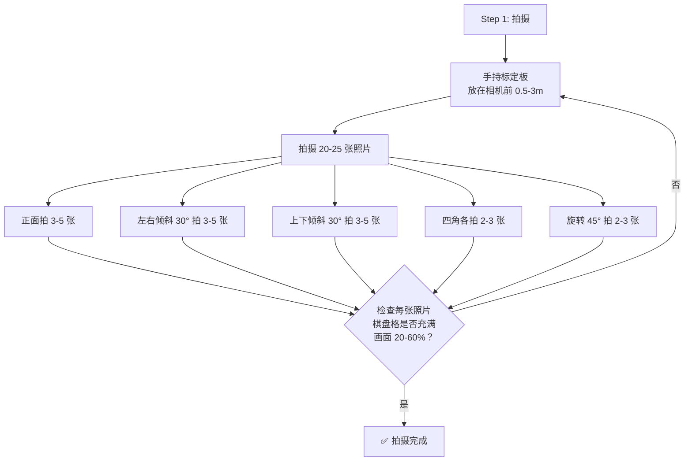


#### 良好 vs 不合格照片对比

| 合格 ✅ | 不合格 ❌ |
|---|---|
| 标定板平整 | 标定板弯曲/折角 |
| 整个棋盘格都在画面内 | 边缘被裁切 |
| 清晰对焦 | 模糊/虚影 |
| 光照均匀 | 半边亮半边暗 |
| 棋盘格占画面 20-60% | 太小或太大 |


---

## 1.5 验证方法

### 1.5.1 视觉验证

```python
# 标定前：
img = cv2.imread("raw.jpg")
# 检查图像边缘的直线是否弯曲
# 例如：场地边界线

# 去畸变后：
undistorted = cv2.undistort(img, K, dist)
# 直线应该变直
```

### 1.5.2 PnP 交叉验证

```
标定相机 → 得到 K, dist
用 PnP 配合已知 3D 点 → 得到 R, T
把 3D 点投影回 2D → 测量残差

如果标定准确：
    PnP 残差 < 5 像素 ✅

如果标定不准：
    PnP 残差 > 20 像素 ❌
    → 重新标定
```


---

## 1.6 另一种工具：ROS 2 `camera_calibration`

如果使用 ROS 2，可以用图形化的 `camera_calibration` 包，交互式移动标定板实时标定：

```bash
# 安装（以 humble 为例，换成你的发行版）
sudo apt install ros-humble-camera-calibration

# 运行（需要先有相机节点在发布 /camera/image_raw）
ros2 run camera_calibration cameracalibrator.py \
    --size 11x8 --square 0.025 image:=/camera/image_raw
```

它会自动采集不同姿态的角点，标定完成后同样输出 `camera_matrix` 和 `dist_coeffs`。本质和 OpenCV 的 `calibrateCamera` 是同一套数学，只是把"拍照→检测→求解"自动化了。

---

# 模块二：三维刚体运动与旋转的四种表述

> 自瞄里描述"装甲板/相机/云台朝向"有四种表述：**旋转矩阵、旋转向量、欧拉角、四元数**。它们各有优缺点，比赛代码里都会遇到。**这一部分我们不自写长篇推导**——可视化的讲解视频比文字高效得多，请按下面的资料学习，并对照"必会结论"自检。

## 2.1 四种表述速览

| 表述 | 参数个数 | 优点 | 缺点 | 用途 |
| --- | --- | --- | --- | --- |
| 旋转矩阵 $R$ | 9 | 连续作用、坐标变换方便 | 冗余、不能直接求导 | 坐标变换、存储 |
| 旋转向量 $\theta\,n$ | 3 | 紧凑 | 有奇异 | 罗德里格斯、代码交换 |
| 欧拉角 RPY | 3 | 最直观 | 万向节死锁 | 人机交互、电控指令 |
| 四元数 $q$ | 4 | 无奇异、适合插值与优化 | 不直观 | 姿态估计、旋转优化 |

## 2.2 先记住一些概念

**① 反对称矩阵**（向量叉乘的矩阵化，旋转求导的地基）：

$$ a \times b = a^{\wedge}\, b, \qquad a^{\wedge} = \begin{bmatrix} 0 & -a_3 & a_2 \\ a_3 & 0 & -a_1 \\ -a_2 & a_1 & 0 \end{bmatrix} $$

**② 旋转矩阵约束**：$R^T R = I$ 且 $\det(R) = 1$，9 个参数只有 $9 - 6 = 3$ 个自由度（正交性 6 个约束）。

**③ 罗德里格斯公式**（旋转向量 ↔ 旋转矩阵）：

$$ R = \cos\theta\, I + (1 - \cos\theta)\, n n^T + \sin\theta\, n^{\wedge}, \qquad \theta = \arccos\!\left( \frac{\operatorname{tr}(R) - 1}{2} \right) $$

代码里用 `cv::Rodrigues(rvec, R)` 双向转换。

**④ 欧拉角与万向节死锁**：Roll（绕前向 $X$）、Pitch（绕 $Y$）、Yaw（绕上方向 $Z$）。当中间一次旋转到 $\pm 90°$ 时，另两个轴对齐、损失一个自由度，即**万向节死锁**。→ 所以计算/优化用四元数或旋转矩阵，只有人机交互用欧拉角。

**⑤ 四元数旋转**（`p` 用纯虚四元数 $[0, x, y, z]$ 表示）：

$$ p' = q\, p\, q^{-1}, \qquad q = \left[ \cos\frac{\theta}{2},\ \sin\frac{\theta}{2}\, n \right] $$

注意两点：**必须双边共轭乘**（否则旋转作用两次）；**构造四元数时转角取 $\theta/2$**（因为左右各乘一次会叠加成 $\theta$）。

## 2.3 学习资料与视频

### 视频（推荐按序看）

**1. 从欧拉角到旋转矩阵（中科大 RM 电控合集）**
*   **视频链接**：https://www.bilibili.com/video/BV1vYCSY2EuS
*   **学习指南**：系统讲清"二维向量旋转 → 坐标系旋转 → 欧拉角 → 三维旋转矩阵"，含内旋/外旋区别。**这是理解欧拉角与旋转矩阵的第一课。**

**2. 无伤理解欧拉角中的"万向死锁"现象（Ele 实验室）**
*   **视频链接**：https://www.bilibili.com/video/BV1Nr4y1j7kn
*   **学习指南**：用直观动画讲透万向节死锁，看完应能用一句话解释"为什么欧拉角会锁死"。

**3. 四元数的可视化（3Blue1Brown）**
*   **视频链接**：https://www.bilibili.com/video/BV1SW411y7W1
*   **学习指南**：经典中的经典。用四维空间的可视化理解"四元数为什么是 4 个数、为什么 $p' = q p q^{-1}$"。建议至少看两遍。

**4. 四元数如何控制物体旋转（小豆）**
*   **视频链接**：https://www.bilibili.com/video/BV14t421h7M4
*   **学习指南**：manim 动画，偏"怎么用"：四元数如何生成、相乘、作用于物体。看完可自行推导 $q\,p\,q^{-1}$ 的分量形式。

### 图文资料

**5. 万向节死锁（zywvvd）**
*   **链接**：https://www.zywvvd.com/notes/3d/gimbal-lock/gimbal-lock/
*   **学习指南**：图文推导死锁的数学本质（欧拉角奇异性），与视频 2 对照理解。

**6. 四元数入门（zywvvd）**
*   **链接**：https://www.zywvvd.com/notes/3d/quaternions-intr/quaternions-intr/
*   **学习指南**：四元数的严谨图文入门：定义、运算、与旋转的对应。作为视频 3/4 的文字补充。

## 2.4 看完你需要掌握什么

- 能说出四种表述各自的参数个数、优缺点，以及在什么场景用哪一种；
- 能用 `cv::Rodrigues` 完成旋转向量 ↔ 旋转矩阵互转；
- 能解释万向节死锁，并说明为什么自瞄内部不用欧拉角做计算；
- 能写出 $p' = q\,p\,q^{-1}$，并解释"为什么转角要减半、为什么要双边乘"；
- 遇到"旋转表示搞混"的位姿 bug 时，知道问题出在旋转矩阵/四元数/欧拉角的哪个环节。

---

# 模块三：PnP 位姿解算

## 3.1 PnP 问题定义

**PnP（Perspective-n-Point）**：已知 $n$ 对"3D 点 ↔ 2D 像素"对应，求相机相对物体的位姿。

```
已知：
  3D 模型点  P_i = (X_i, Y_i, Z_i)   —— 装甲板物理尺寸（长/宽已知，来自规则）
  2D 像素点  p_i = (u_i, v_i)        —— 检测到的四角点 / 灯条端点
  相机内参   K                       —— 模块一标定得到

求解：
  外参 [R | t]                       —— 装甲板相对相机的位姿
      → 敌方距离 (X, Y, Z) 与瞄准所需的 Yaw / Pitch
```

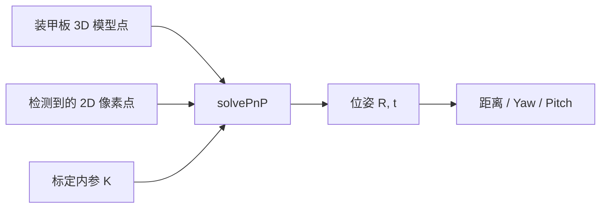

## 3.2 解法概览

- **DLT（直接线性变换）**：把投影方程整理成 $A\,x = 0$，每点提供 2 个方程，**需 ≥ 6 对点**，SVD 求解；结果需投影回 $\mathrm{SO}(3)$；
- **P3P**：3 对点直接解，快但易受噪声影响；
- **EPnP**：用 4 个控制点表示 3D 点，$n$ 较大时精度/速度均衡；
- **非线性优化（BA）**：以解析解为初值，最小化重投影误差（3.3），最稳。

## 3.3 重投影误差与优化（关键公式）

把当前位姿下的 3D 点投影回图像，与检测像素比较：

$$ e_i = p_i - \frac{1}{Z_i}\, K\, \exp\left(\xi^{\wedge}\right) P_i $$

目标是最小化误差平方和（非线性最小二乘，用高斯牛顿 / LM 迭代）：

$$ \min_{\xi}\ \frac{1}{2} \sum_{i=1}^{n} \left\| e_i \right\|^2, \qquad \text{高斯牛顿正规方程：} J^T J\, \Delta\xi = -J^T f $$

> 工程上直接用现成库（OpenCV 内部 / Ceres / g2o）。**你不必手写优化器，但要知道它在最小化什么**。涉及的李群李代数细节放在文末拓展部分，学有余力再深入。

## 3.4 OpenCV 工程实战：solvePnP 到云台角度

### 3.4.1 基本用法

```cpp
// 3D 模型点：装甲板四角，物理尺寸（单位与 tvec 一致，通常 mm）
std::vector<cv::Point3f> object_pts = {
    {-half_w,  half_h, 0}, { half_w,  half_h, 0},
    { half_w, -half_h, 0}, {-half_w, -half_h, 0},
};
// 2D 图像点：检测到的四个角点（顺序必须与 3D 点一一对应！）
std::vector<cv::Point2f> image_pts = { /* 来自 Detector */ };

cv::Mat rvec, tvec;
cv::solvePnP(object_pts, image_pts, K, dist, rvec, tvec);
```

**方法选择**：装甲板四角点共面 → **`SOLVEPNP_IPPE`**（利用共面约束，快且稳）；不放心用 `SOLVEPNP_ITERATIVE` 兜底。有误匹配角点时改用 `cv::solvePnPRansac` 剔除离群点。

### 3.4.2 得到 Yaw / Pitch

`tvec` 就是装甲板在相机系下的坐标（单位与 object_pts 一致）：

```cpp
double X = tvec.at<double>(0);
double Y = tvec.at<double>(1);
double Z = tvec.at<double>(2);

double pitch = std::atan2(Y, Z);   // 俯仰（相机系右X、下Y、前Z）
double yaw   = std::atan2(X, Z);   // 偏航
```

**工程要点**：

1. **角点顺序必须一一对应**：3D/2D 顺序错位，位姿直接错乱且不报错——PnP 最常见、最隐蔽的 bug；
2. **单位统一**：object_pts 用 mm，tvec 就是 mm；
3. **角度定义对齐电控**：yaw/pitch 定义、正负方向必须和电控对齐，否则"解对了却打不准"；
4. **距离近时角度误差被放大**：$Z$ 小，同样像素误差对应更大角度抖动，可用多帧平滑（文档 12 Kalman）。

## 3.5 学习资料与需要掌握什么

### 学习视频

**1. 2025 视觉组培训第五课【装甲板位姿解算】（同济大学 SuperPower 战队）**
*   **视频链接**：https://www.bilibili.com/video/BV1qkxceWEh4
*   **学习指南**：RM 战队视角讲位姿解算全流程，配合本模块的公式食用。看完应能解释"为什么 detector 要输出四角点，而不是直接用灯条中心"。

### 看完你需要掌握什么

- 能说出 PnP 的输入（3D 模型点、2D 像素点、$K$）与输出（$[R \mid t]$）；
- 能解释重投影误差在优化什么，以及为什么解析解还需要 BA 迭代；
- 能独立写好 `solvePnP`（选对 `SOLVEPNP_IPPE`/`ITERATIVE`）并算对顺序；
- 能把 `rvec`/`tvec` 转成云台要的 Yaw/Pitch，并意识到"角度定义要对齐电控"。

---

# 拓展学习（学有余力）：李群与李代数

> 这一部分**不强制要求**。它回答一个"进阶"问题：为什么旋转矩阵不能直接求导做优化、以及重投影误差的雅可比怎么来。等自瞄跑通、想做更深优化（自定义 BA、手写 Ceres 残差块）时再回来看。

## 一句话背景

旋转矩阵集合 $\mathrm{SO}(3)$ 对矩阵**加法不封闭**（$R_1 + R_2 \notin \mathrm{SO}(3)$），无法按普通微积分求导。解决思路：把旋转的"微小增量"放到**切空间（李代数）** 上描述，再用**指数映射** $\exp(\phi^{\wedge})$ 回到旋转——增量加法由此可行，优化也能做了。

## 学习资料

**1. 视觉 SLAM 十四讲 · 第 4 讲：李群与李代数（高翔）**
*   **视频链接**：https://www.bilibili.com/video/BV1LT411V7zv
*   **学习指南**：SLAM 领域的标准教材配套视频，系统推导指数映射、李括号、扰动模型。建议配合《视觉 SLAM 十四讲》书本第 4 讲一起看。

## 需要掌握什么

- 能解释"为什么旋转矩阵不能直接求导"，以及李代数/指数映射如何解决；
- 知道指数映射对 $\mathfrak{so}(3)$ 就是罗德里格斯公式；
- 记住扰动模型的核心结论：$\dfrac{\partial (R\,p)}{\partial \phi} = -\,(R\,p)^{\wedge}$（BA 雅可比推导的起点）。

---

## 总结

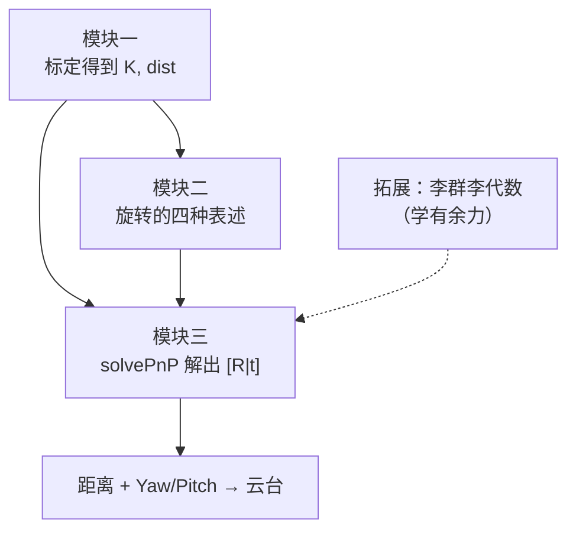

| 模块 | 定位 | 核心结论 |
| --- | --- | --- |
| 模块一 小孔成像与标定 | 必学 | 四大坐标系链路；$K$ 内参；畸变 $[k_1,k_2,p_1,p_2,k_3]$；标定输出 yaml |
| 模块二 旋转四种表述 | 必学·以资料为主 | 旋转矩阵/旋转向量/欧拉角(死锁)/四元数($p'=qpq^{-1}$)，看视频+必会结论 |
| 模块三 PnP 位姿解算 | 必学·自瞄核心 | 3D-2D 对应求 $[R \mid t]$；`solvePnP` 实战；Yaw/Pitch |
| 拓展 李群与李代数 | 学有余力 | 加法不封闭→指数映射→扰动模型 $\partial(Rp)/\partial\phi=-(Rp)^{\wedge}$ |

读完本文，你应该能走通自瞄的因果链：**标定给出内参 → 检测给出像素 → 物理模型给出 3D 点 → PnP 解出位姿 → 角度送给云台**。下一步建议阅读文档 12（Kalman 滤波，对位姿结果做平滑与预测）和文档 13（自瞄框架，把这些模块拼成完整系统）。
