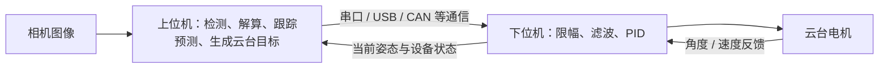
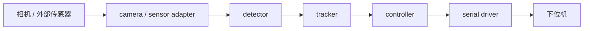
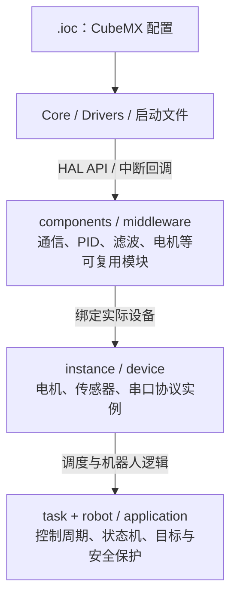
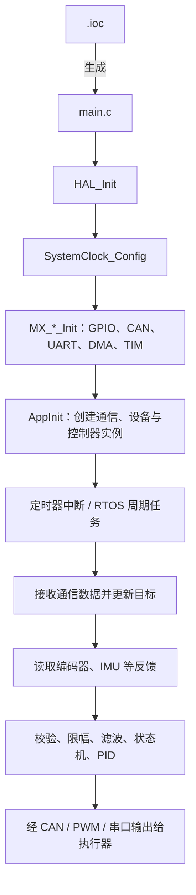
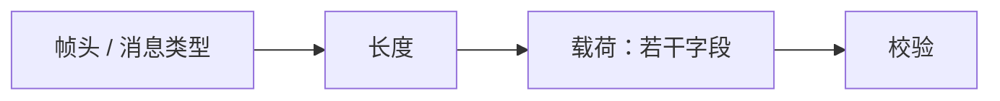
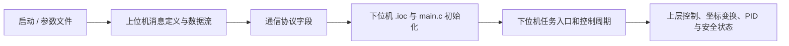

本文讲的是一套通用的理解框架，不依赖具体的车、板卡、仓库或通信协议。读完后，面对一份新的自瞄项目，你应该能快速分清上位机和下位机的职责，知道从哪里开始读、可以改哪里，以及哪些部分要交给电控负责人。

## 1. 为什么自瞄要分上下位机

自瞄系统同时要做两类性质不同的工作：

- 看图、识别装甲板、预测运动，需要较强的算力和 Linux 环境；
- 读取电机反馈、毫秒级闭环控制、驱动 CAN 电机，需要稳定且实时的嵌入式系统。

因此通常将系统分为上下位机：

上位机给下位机的通常是“云台应看向哪里”，目标角速度或工作模式；下位机根据编码器、IMU 等反馈决定“怎样稳定地到达那里”。上位机不直接输出电机电流，下位机也不需要理解图像里是否出现了装甲板。

| 角色 | 主要工作 | 典型输入 | 典型输出 |
| --- | --- | --- | --- |
| 上位机 | 相机采集、识别、位姿解算、跟踪、预测、目标选择 | 图像、相机参数、下位机反馈 | 目标角度、目标速度、工作模式 |
| 下位机 | 传感器读取、通信接收、滤波、PID、安全状态与电机控制 | 上位机目标、编码器/IMU/遥控器状态 | 电机命令、当前姿态、设备/比赛反馈 |

调试也按这个方向来：先确认目标识别和目标值是否合理，再确认通信数据的单位、符号和时效，最后才看云台动作。方向反了、单位混用、旧数据没超时，表现出来往往都像“PID 没调好”。

## 2. 两种常见上位机：NUC 与 NVIDIA Jetson NX

两者都可以运行 Linux 和 ROS 2，也都能承担相机、检测、跟踪和通信任务；区别主要在硬件架构与深度学习推理后端。

| 平台 | 特点 | 常用推理路径 | 关注点 |
| --- | --- | --- | --- |
| Intel NUC | x86 平台，Intel CPU/iGPU | OpenVINO 或 CPU 推理，通常使用 ONNX 模型 | x86 依赖、CPU/iGPU 占用、散热 |
| NVIDIA Jetson NX | ARM 平台，NVIDIA GPU | CUDA/TensorRT 推理 | JetPack、CUDA/TensorRT、显存与散热 |

对控制链路来说，两台机器输出的 ROS 消息和发给下位机的控制命令应当一致，切换 NUC 或 NX 不应改变坐标系、角度单位或通信协议。

TensorRT 的 Engine 通常和 GPU 架构、CUDA 与 TensorRT 版本绑定，要在最终运行的 Jetson 上生成，不要直接复用另一台机器生成的 Engine。这个差异只发生在图像如何推理这一层，不影响下位机怎样驱动电机。

## 3. 如何理解上位机工程

上位机常以 ROS 2 workspace 组织。组织良好的工程会把模块按职责拆开，让你从数据流入手阅读，而不是一上来就啃几千行代码：

常见 ROS 2 包及职责如下：

| 包类型 | 责任 | 阅读时重点看什么 |
| --- | --- | --- |
| `camera` | 发布图像与相机内参 | 图像话题、分辨率、时间戳、相机坐标系 |
| `detector` | 从图像找出候选目标 | 输入输出消息、置信度、模型/传统视觉参数 |
| `tracker` | 关联目标、平滑状态、处理短时丢失 | 目标有效条件、超时、预测结果 |
| `controller` | 将目标位置转成云台目标 | 坐标变换、单位、限幅、上层控制策略 |
| `serial_driver` | 将 ROS 消息编解码为实际通信帧 | 字段顺序、长度、校验、重连与超时 |
| `robot_description` | 维护传感器、云台与相机的坐标关系 | TF 树、外参、命名约定 |
| `launcher` | 组合节点并加载不同运行参数 | 启动顺序、比赛/调试 profile、参数文件 |
| `recorder` | 录制传感器、目标、命令与反馈 | 是否能复现一次调参或故障 |

其中最值得先读的是消息定义、参数文件和启动文件。它们告诉你模块之间交换什么数据、以什么单位运行、当前启用了哪套参数。读懂这些之后再深入某个算法实现，效率最高。

## 4. 下位机：一个 CubeMX 项目的通用框架

下位机通常是一个 STM32 固件工程，最终交叉编译成 `.elf`、`.hex` 或 `.bin`，烧录到 MCU 的 Flash 中运行，它不是另一个 ROS 工程。

CubeMX 的作用是把硬件配置变成初始化代码：选择 MCU，配置时钟、引脚、CAN、UART、DMA、定时器和中断，再生成基础工程。团队代码在这个基础上实现通信、控制和机器人行为。

目录名称会因团队而异，但职责通常能对应到下面的表：

| 目录/文件 | 作用 | 修改边界 |
| --- | --- | --- |
| `*.ioc` | CubeMX 的硬件配置源：时钟、引脚、外设、DMA、中断 | 改动前确认硬件影响；重新生成以它为准 |
| `Core/Inc`、`Core/Src` | CubeMX 生成的 `main.c`、GPIO、CAN、UART、定时器与中断基础代码 | 仅在 `USER CODE BEGIN/END` 区放必要代码，不手改生成区 |
| `Drivers/` | CMSIS、STM32 HAL 等第三方驱动 | 视为依赖库，不直接修改 |
| `startup_*.s`、链接脚本、工具链配置 | 上电启动、内存布局、编译/链接规则 | 通常不修改 |
| `components/`、`middleware/` | 通信管理器、PID、滤波、电机等通用实现 | 可阅读和复用；改动需考虑所有使用者 |
| `instance/`、`device/` | 将通用组件绑定到具体电机、总线或传感器 | 查找硬件实例、协议对象和默认参数 |
| `task/`、`application/` | 定时任务、通信回调、状态机 | 查找控制在哪个周期执行 |
| `robot/`、`modules/` | 上层机器人行为：目标处理、控制串级、安全逻辑 | 控制、坐标、策略修改最常进入这里 |
| `tests/` | 在电脑上运行的协议、限幅、PID 等测试 | 修改算法后优先执行或补充测试 |
| `CMakeLists.txt` / `Makefile` | 组织源文件、工具链和构建产物 | 用来理解工程如何编译，不随意删改源文件列表 |

## 5. 从上电到电机：怎么读下位机数据流

不管工程用裸机循环还是 RTOS，思路都是先初始化，再由固定节拍或任务调度执行控制。一个常见的 CubeMX 裸机框架如下：

对视觉组来说，要修改上层算法，最重要的是确认四件事：

1. 控制函数由哪个定时器或任务调用，周期是多少；
2. 上位机数据从哪个回调进入，何时被写入共享状态；
3. 电机反馈的单位、零点和正方向是什么；
4. 指令送到电机前经过了哪些限幅、滤波和安全检查。

不要在高频中断或控制任务里加入阻塞通信、文件操作、大量日志或动态内存分配，这些都会破坏实时性，表现为控制抖动、丢帧或看似随机的故障。

## 6. 上下位机通信：看语义，不只看字节

通信帧通常长这样：

新人不需要先实现串口驱动，但必须读懂每个字段的语义、单位、正方向和无效行为。一份控制接口至少要写清：

| 方向 | 常见字段 | 必须说明的内容 |
| --- | --- | --- |
| 上位机 → 下位机 | 目标 pitch/yaw、目标速度、模式、有效标志 | rad 还是 deg；绝对角还是增量；正方向；超时后如何处理 |
| 下位机 → 上位机 | 当前 pitch/yaw、角速度、设备状态、比赛状态 | 反馈来源；时间戳；是否已滤波；无效值和断线语义 |

最常见的联调错误有三类：

- **单位错**：一个模块用度，另一个模块用弧度；
- **方向错**：图像里向右的误差被当成云台应向左运动；
- **时效错**：目标已经丢失，控制器却还在用旧包。

排查时依次打印或可视化“上位机输入 → 上位机目标 → 通信字段 → 下位机目标 → 下位机反馈”，每次只验证一个量，比如先验证 yaw 的正方向，再验证 pitch，最后才打开连续跟随。

## 7. CubeMX 重新生成需要注意

`.ioc` 是硬件配置的来源。要改 UART、CAN、DMA、时钟、引脚或中断优先级，应在 CubeMX 里改 `.ioc` 后重新生成，而不是只改生成出来的 `.c` 文件。不过视觉组一般不会直接和 `.ioc` 打交道。重新生成会覆盖大部分 `Core/` 代码，但会保留标记为 `USER CODE` 的区域。

因此建议遵循以下规则：

1. 只改坐标系、目标生成、PID 参数或上层控制时，优先改 `robot/application`、`task` 或项目约定的配置层；
2. 需要改外设配置时，先和电控负责人确认硬件和协议影响；
3. 重新生成后查看 `git diff`，确认用户代码和构建文件都没有丢失；
4. 不修改 `Drivers/`，也不要把“临时改一下生成的 UART/CAN 文件”当成长期方案。

## 8. 推荐的阅读顺序

面对一个陌生项目，可按这条路线建立全局认识：

这条路线不是要你立刻上手写底层，而是让你能安全地走完“读懂现成项目 → 修改上层算法或参数 → 编译烧录 → 用反馈验证”这一圈。凡是涉及硬件接线、外设初始化、DMA 或中断配置、协议变更的修改，都要和电控负责人一起完成。
