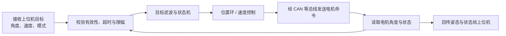
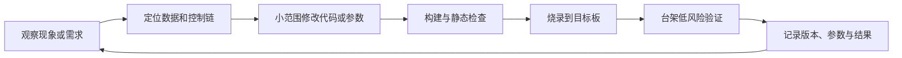
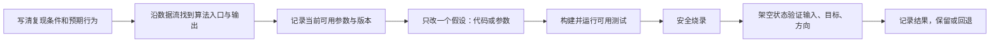

视觉和电控在联调时面对的是同一台机器人，只是观察系统的角度不同。视觉新人不需要立刻掌握驱动、PCB 或电机底层协议，但应理解电控每天怎样开发、怎样把程序放进 C 板、怎样验证结果；这样遇到控制或坐标问题时，才能自己完成属于视觉的修改，并把其他问题准确地交给电控同学。

## 1. 谁负责什么

实际分工随队伍变化，但可以先按下面的边界理解：

| 模块 | 典型负责人 | 修改前应确认什么 |
| --- | --- | --- |
| 板卡、供电、线束、固件升级 | 硬件 / 电控 | 板型、接口、电源与安全状态 |
| CubeMX、时钟、引脚、DMA、中断 | 电控 | 是否会重新生成代码，生成区边界 |
| 电机驱动、编码器、IMU、CAN | 电控 | 反馈单位、零点、限位、使能条件 |
| 协议、坐标系、控制目标 | 电控搭建接口，视觉参与维护 | 字段语义、版本、坐标和单位 |
| 识别、预测、目标选择 | 视觉 | 输出频率、置信度、无目标行为 |

视觉并不是“只管上位机”。如果问题发生在目标角度生成、坐标变换、顶层控制策略或视觉与云台的接口处，视觉成员应能读懂、修改、构建和验证下位机中的对应部分。相反，硬件、外设初始化和底层驱动出现问题时，最有价值的贡献是提供准确现象和证据，而不是盲改。

## 2. 电控平时在做什么

电控工作并不只是“调 PID，LQR”。团队下位机项目的日常工作可以落到一条具体的控制链上：接收上位机给出的云台目标，读取两轴电机的真实角度，检查数据是否有效并限制危险目标，经过滤波和位置控制得到电机输入，再回传当前姿态和状态。电控成员每天围绕这条链路开发、测试和联调。

| 场景 | 常见工作 | 目的 |
| --- | --- | --- |
| 电脑上 | 阅读需求、改控制逻辑、调整参数、编译、跑主机测试、看代码差异 | 在上板前尽可能发现逻辑和构建错误 |
| VS Code 中 | 跳转代码、搜索数据流、配置 CMake、查看编译报错、启动调试 | 快速定位代码位置和问题层级 |
| 台架上 | 烧录固件、看串口日志、用调试器查看变量、做小幅动作测试 | 验证真实板卡、传感器和电机行为 |
| 机器人上 | 联调视觉输入、检查限位/安全状态、测试完整行为 | 验证整条感知—控制链路 |
| 协作中 | 记录版本、参数、现象和测试条件 | 让队友能复现、回退和继续工作 |

在一份典型的两轴云台固件中，控制任务每个周期会做如下事情：



这张图是理解“电控在干什么”的核心。视觉同学最常参与的是 `command`、`validate` 和 `filter` 附近的目标生成、坐标变换、限幅和丢目标策略；电机反馈采集、CAN 驱动和硬件保护通常由电控维护。

可以把电控的日常循环概括为：



不是每次修改都要上机器人：改完编译失败，先解决编译；改动只影响数学函数，先跑主机测试；只有需要验证真实传感器、电机或通信时才上板。这样更快，也更安全。

## 3. 先认识几个基础概念

| 概念 | 简单解释 | 你什么时候会用到 |
| --- | --- | --- |
| **构建（build）** | 把 C/C++ 源码编译、链接成可运行的固件 | 每次代码或配置改动后 |
| **交叉编译** | 在电脑上生成给 STM32 运行的程序，而不是给电脑运行的程序 | 使用 ARM GNU Toolchain 时 |
| **固件（firmware）** | 最终运行在 MCU 内的程序，常见产物为 `.elf`、`.hex`、`.bin` | 烧录和版本确认 |
| **烧录（flash/program）** | 将固件写入 C 板的 Flash | 让板子运行新版本 |
| **调试器（debugger）** | 连接运行中的 MCU，暂停程序、设断点、查看变量和调用栈 | 串口日志无法说明问题时 |
| **串口日志** | 程序通过 UART 输出的文字或结构化数据 | 看版本、输入、目标值、错误状态 |
| **断点（breakpoint）** | 程序执行到指定行时暂停 | 确认某分支是否执行、变量何时变化 |
| **Watch/变量监视** | 调试器持续显示指定变量 | 看目标角度、反馈、误差、状态机 |
| **台架测试** | 让机构架空/限功率，逐项测试 | 首次烧录或调控制时 |

构建成功只说明“这份代码能被编译器接受”；烧录成功只说明“这份固件已写进目标板”；只有台架测试和联调通过，才能说明“机器人行为正确”。三者不能互相替代。

## 4. 调试不只是在代码里加 `printf`

按从轻到重的顺序选择工具：

| 方法 | 适用问题 | 注意事项 |
| --- | --- | --- |
| 编译器报错/静态检查 | 拼写、类型、接口不匹配 | 先解决第一条错误 |
| 串口日志 | 状态机是否进入、目标/反馈是否正确 | 高频控制任务中不要大量打印 |
| 可视化/曲线 | 目标、反馈、误差、输出随时间的关系 | 最适合判断振荡、延迟和限幅 |
| 断点与变量监视 | 某个条件为何未触发、变量在哪里被改 | 暂停 MCU 会影响实时控制，台架使用 |
| 主机测试 | 协议解析、坐标数学、限幅、PID 的纯逻辑 | 不替代真实硬件验证 |
| 逻辑分析仪/示波器 | 串口/CAN 时序、信号质量、电源问题 | 通常与电控成员共同使用 |

调试时应围绕一个问题设计观察量。例如“云台向反方向转”时，依次确认图像误差符号、上位机目标、通信字段、下位机参考值、反馈角度和电机输出；不要同时改坐标系、PID 和协议。

## 5. 视觉负责的顶层算法发现问题时，怎样修改

先判断问题是否属于视觉可以维护的层：目标角度生成、坐标变换、视觉输入有效性、上层限幅、目标丢失策略和明确开放的控制参数，通常属于可参与修改的范围。

一次修改建议遵循下面的流程：



具体做法：

1. 用固定输入或可复现场景描述问题，例如“目标在画面右侧时，期望 yaw 应增加”；
2. 从消息定义、参数和控制入口找数据，不从底层 UART/DMA 文件开始；
3. 将偏置、限幅、坐标转换等放在已有的上层配置或函数中，不散落魔法数字；
4. 每次只改一个量，并保留修改前的参数；
5. 先验证“下位机收到的目标是否对”，再验证电机动作；
6. 如出现异常运动、过热、失控或不确定限位，立即停止执行器并回到已知可用版本。

## 6. 发现非视觉负责的问题时，怎样做

不负责不等于不关心。你应当把“我觉得不对”变成一个电控同学可立即检查的问题单。

先区分问题层级：

| 观察到的现象 | 可能层级 | 视觉成员应做什么 |
| --- | --- | --- |
| 上位机目标正确，但下位机收到的字段不对 | 通信/协议 | 保存收发日志、单位和时间戳，交给接口负责人 |
| 下位机目标正确，电机不动 | 使能、驱动、CAN、硬件 | 停止测试，记录状态，不盲改底层 |
| 电机方向/零点异常 | 编码器、标定、机械/电机配置 | 架空并记录反馈与实际运动，通知电控 |
| 构建或烧录失败 | 工具链、下载器、板卡连接 | 保存第一条错误、工具版本和连接状态 |
| 通信偶发断线或数据异常 | 线束、供电、串口/CAN、时序 | 记录复现条件与日志，必要时共同测量 |

一次高质量反馈至少包含：现象、复现步骤、代码版本、使用的参数、板卡/下载器状态、已观察到的输入/目标/反馈，以及你希望确认的具体问题。例如：

```text
现象：上位机目标 yaw 连续增加，但云台保持不动。
复现：架空、低功率、仅开启云台控制；每次都可复现。
版本与参数：<填写当前提交和参数版本>。
观察：上位机目标和下位机参考值均变化，电机反馈不变化。
希望协助确认：电机使能状态、CAN 通信与驱动侧故障状态。
```

人和设备安全永远优先于继续调试。电机异常转动、过热、冒烟、线束松动或失控时，先按队内流程断使能/断电并通知负责人；不要在带载、贴近人或限位不明的状态下反复烧录试错。

做到这些，你不必成为完整的电控开发者，也能可靠地参与下位机顶层算法、烧录与联调，并让视觉和电控之间的问题更快闭环。
