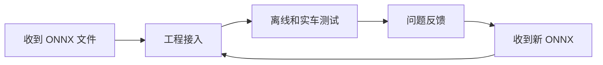

> 本文面向**需要使用神经网络模型的队员**。
>
> 我们的神经网络主要基于 **Ultralytics YOLO**，使用模型的队员拿到的交付物就是 **ONNX 文件**。使用方不需要关心模型如何制作，但必须理解模型在工程中的输入、输出、接入方式和反馈责任。

## 0. 先建立整体认识

在 RoboMaster 视觉系统里，YOLO 通常承担“从图像中找目标”的任务：

```text
工业相机 → 图像 → YOLO 检测 → 目标框 / 类别 / 置信度 → 后处理 → 位姿解算 / 跟踪 / 控制
```

它输出的是二维检测结果，而不是完整的自瞄答案。模型告诉你“图像哪里像目标”，后面的目标筛选、坐标反算、PnP、跟踪、预测、弹道补偿和控制仍然由工程代码完成。

模型的工程链路大致是：



因此使用模型不是“拿到一个文件就结束”。模型使用方必须做到两件事：

- **模型有问题就及时反馈**，不要把问题拖到赛前或正式上场前才说；
- **有新模型产出就及时使用和验证**，不要一直停留在旧模型上测试旧问题。

## 1. 必须先会查官方文档

Ultralytics 的命令、参数和默认行为可能随版本变化。遇到预测命令、输入尺寸、输出格式不确定时，优先查官方文档。

建议收藏：

- Ultralytics 文档总入口：<https://docs.ultralytics.com/>
- Predict 模式：<https://docs.ultralytics.com/modes/predict/>
- Detect 任务说明：<https://docs.ultralytics.com/tasks/detect/>
- ONNX 集成说明：<https://docs.ultralytics.com/integrations/onnx/>

最小安装与验证：

```bash
# 建议先创建单独的 Python 环境，避免污染系统环境。
python3 -m venv .venv
source .venv/bin/activate

# 安装 Ultralytics。
pip install ultralytics

# 验证命令是否可用。
yolo version
```

如果你只负责 C++ 工程接入，也建议保留一个能运行 `yolo predict` 的 Python 环境。它可以作为“官方推理结果”的对照，帮助判断问题出在模型本身，还是出在工程前处理、输出解析或后处理。

## 2. 你需要理解模型的输入输出

拿到模型时，不要只问“这个模型准不准”。你至少要向模型负责人确认这些信息：

| 项目 | 需要确认的内容 |
| --- | --- |
| 模型文件 | ONNX 文件名和版本号，例如 `armor-yolo-v2026.08.27.onnx` |
| 输入尺寸 | 例如 `640x640`，接入端必须保持一致 |
| 输入通道 | RGB 还是 BGR |
| 前处理 | 是否 letterbox、是否除以 `255.0`、是否归一化 |
| 类别表 | 每个 `class_id` 对应什么目标 |
| 输出格式 | 框坐标格式、置信度、类别编号、是否包含 NMS |
| 推荐阈值 | `conf`、`iou` 或工程侧筛选阈值 |
| 适用场景 | 该模型主要解决了哪些问题，仍有哪些已知缺陷 |

模型输出不要直接当作最终目标。接入工程时通常还需要：

- 根据置信度和类别过滤；
- 根据业务规则选择目标；
- 对框中心、角点或目标 ID 做时序稳定；
- 和传统视觉、PnP、Tracker、状态机对齐；
- 处理无目标、目标切换和异常输出。

## 3. 拿到 ONNX 后先做基础验证

使用方拿到 ONNX 后，应先在自己的环境中做一次最小验证：

```bash
yolo predict model=armor-yolo-v2026.08.27.onnx source=test.mp4 imgsz=640 conf=0.35
```

这一步的意义不是证明模型能上场，而是确认：

- ONNX 文件没有损坏；
- 当前环境可以加载模型；
- 类别表和输出结果看起来一致；
- 基本画框位置正常；
- 测试视频能顺利跑完。

ONNX 是模型交付文件，不是免责文件。Python 侧 `yolo predict` 正常，只能说明模型和官方推理链路基本正常；如果 C++ 工程里效果异常，还要继续检查工程接入。

## 4. 接入工程时重点检查什么

很多“模型效果差”其实不是训练问题，而是接入端前处理或输出解析不一致。

接入时优先检查：

- BGR / RGB 是否搞反；
- resize 是否保持比例；
- letterbox 的 padding 是否在坐标反算时扣掉；
- 是否按模型说明使用同样的 `imgsz`；
- 像素值是否除以 `255.0`；
- 归一化是否漏做或做了两次；
- 类别编号表是否是当前模型对应版本；
- NMS 或工程筛选阈值是否和验证时差异过大；
- 输出张量维度和坐标格式是否解析正确。

建议保留一套固定对照样例：

```text
test_cases/
├── empty_field.mp4
├── static_armor_near.mp4
├── static_armor_far.mp4
├── moving_armor.mp4
└── reflection_negative.mp4
```

每次更换新 ONNX 后，至少在这些样例上跑一遍。这样新旧模型的表现才有可比性。

## 5. 模型有问题必须及时反馈

模型迭代最怕一句话反馈：

```text
模型不行，容易误检。
```

这句话没有复现条件，无法转化为有效迭代。使用方看到问题时，不要等“再多试几天”才说。**只要问题可能影响识别稳定性，就应该及时反馈。**

及时反馈的原因很简单：

- 问题确认、补数据、重新产出模型需要时间；
- 标注和补数据需要时间；
- 新模型接入和回归测试也需要时间；
- 很多问题只有在特定相机参数、场地灯光和运动状态下才会出现，错过现场就很难复现。

推荐反馈格式：

```text
模型版本：armor-yolo-v2026.08.27.onnx
部署端：自瞄主相机，imgsz=640，conf=0.35，iou=0.45
场景：实验室半场，红方装甲板，距离约 5m，曝光 1200us
问题：快速横移时 3 号装甲板连续漏检，静止时正常
证据：视频文件 rm_test_0827_2.mp4，问题出现在 00:12-00:18
期望：至少稳定输出同一块装甲板，允许框略有抖动
补充：同一视频中 1 号装甲板正常
```

遇到问题时，请尽量保存：

- 原始相机视频或图片，不要只发屏幕录制；
- 当前 ONNX 模型文件名和版本；
- 推理输入尺寸、置信度阈值、NMS 阈值；
- 相机曝光、增益、分辨率和帧率；
- 问题发生的具体时间段；
- 期望行为与实际行为；
- 如果有日志，保存目标框、类别、置信度和时间戳。

下面这种反馈是有价值的：

```text
在 2026-08-27 晚上场地测试中，使用 armor-yolo-v2026.08.27.onnx。
视频 rm_test_0827_2.mp4 的 01:34-01:41，蓝方 4 号装甲板在 6m 左右横移时漏检。
同一段视频里静止和近距离识别正常。conf=0.35，iou=0.45，曝光 1000us，增益 8。
```

下面这种反馈无法直接处理：

```text
昨天模型有点抽象，你们再训一下。
```

## 6. 有新模型产出就要及时使用

如果模型负责人已经产出新的 ONNX，使用方应尽快替换并验证。不要一边反馈旧模型的问题，一边长期不切换新模型；这样会让模型负责人和使用方讨论的对象不一致，浪费大量时间。

更换新模型时要做三件事：

1. **记录版本**：明确当前使用的 ONNX 文件名、提交时间和来源；
2. **完成最小回归**：用固定测试视频跑一遍，确认没有明显退化；
3. **继续实车观察**：把新问题和旧问题分开记录，避免混在一起。

模型更新记录建议写成：

```text
2026-08-27 21:30
自瞄模块模型从 armor-yolo-v2026.08.24.onnx 切换到 armor-yolo-v2026.08.27.onnx。
固定测试集通过；moving_armor.mp4 中远距离蓝方 4 号漏检有所改善。
待继续观察：强反光背景下是否仍有误检。
```

模型文件名、类别表、输入尺寸和阈值要一起更新。只替换 `.onnx`，但继续使用旧类别表或旧阈值，很容易制造新的假问题。

## 7. 短时间测试不能证明模型能上场

一次短时间测试只能说明“在这段视频、这组参数、这个场景里暂时没出问题”，不能证明模型已经具备上场可靠性。

RM 场景的变化太多：

- 场地灯光会变；
- 机器人姿态和速度会变；
- 相机曝光和增益会变；
- 目标距离、角度和遮挡会变；
- 背景反光、灯条、队友车和裁判系统会变；
- 比赛中的振动、热量、线缆状态和算力占用也会变。

因此不要因为模型在实验室里跑了十分钟没出问题，就认定“这个模型稳了”。更合理的说法是：

```text
该模型通过了当前固定测试视频和本次实车短测，可以进入下一轮更长时间、更复杂场景验证。
```

上场前至少要经过：

- 固定测试集回归；
- 多段真实相机视频离线回放；
- 不同距离、角度、光照下的实车测试；
- 无目标和强干扰场景测试；
- 与完整自瞄链路联调；
- 新旧模型对比记录；
- 已知问题确认和风险评估。

短测不能给模型盖章，但短测发现的问题必须立刻反馈。这个节奏很重要：**不要用短测证明可靠性，要用短测尽早暴露问题。**

## 8. 使用模型时不要随意改的东西

除非和模型负责人确认，否则不要随意修改：

- 类别顺序；
- 输入尺寸；
- 前处理方式；
- 输出解析逻辑；
- 置信度阈值和 NMS 阈值；
- ONNX 文件名但不改版本记录；
- 模型文件和类别表的对应关系。

如果确实要临时改阈值，必须记录修改前后现象。阈值调高可以减少误检，但可能增加漏检；阈值调低可以增加召回，但可能让跟踪器吃进错误目标。阈值不是万能修复按钮。

## 9. 模型问题的快速归因表

| 现象 | 优先检查 |
| --- | --- |
| Python 预测正常，C++ 接入效果很差 | 前处理、通道顺序、letterbox 坐标反算、输出解析 |
| ONNX 无法加载 | ONNX 文件是否损坏、运行库版本、模型路径、opset 支持 |
| 静态目标正常，运动目标漏检 | 运动模糊数据不足、曝光过长、阈值过高 |
| 远距离目标漏检 | 输入尺寸、模型尺度、远距离数据不足、镜头焦距和成像质量 |
| 背景灯条误检 | 负样本不足、类别定义不清、置信度阈值过低 |
| 类别经常混淆 | 标注混乱、类别外观相似、类别表版本不一致 |
| 检测框稳定但自瞄打偏 | 后处理、PnP、坐标系、标定、控制，不应先怪模型 |
| 换新模型后突然异常 | 类别表、输入尺寸、阈值、前处理是否同步更新 |

## 10. 使用方交付标准

作为模型使用方，你的工作不是证明某个模型“绝对能上场”，而是持续把模型接入好、测试好、反馈好。

你至少应做到：

- 当前工程使用的是最新确认版本的 ONNX；
- 知道模型输入尺寸、类别表、前处理和推荐阈值；
- 能用固定测试视频跑最小回归；
- 能区分模型问题、接入问题和后处理问题；
- 发现误检、漏检、类别错误或延迟异常时及时反馈；
- 新模型产出后及时替换测试；
- 不用短时间测试给模型可靠性下最终结论；
- 每次实车测试都留下模型版本和问题记录。

神经网络模型是持续迭代的工程模块。及时反馈，及时更新，持续验证，才是让 YOLO 从“能画框”变成“能在赛场上帮系统稳定工作的检测器”的关键。
