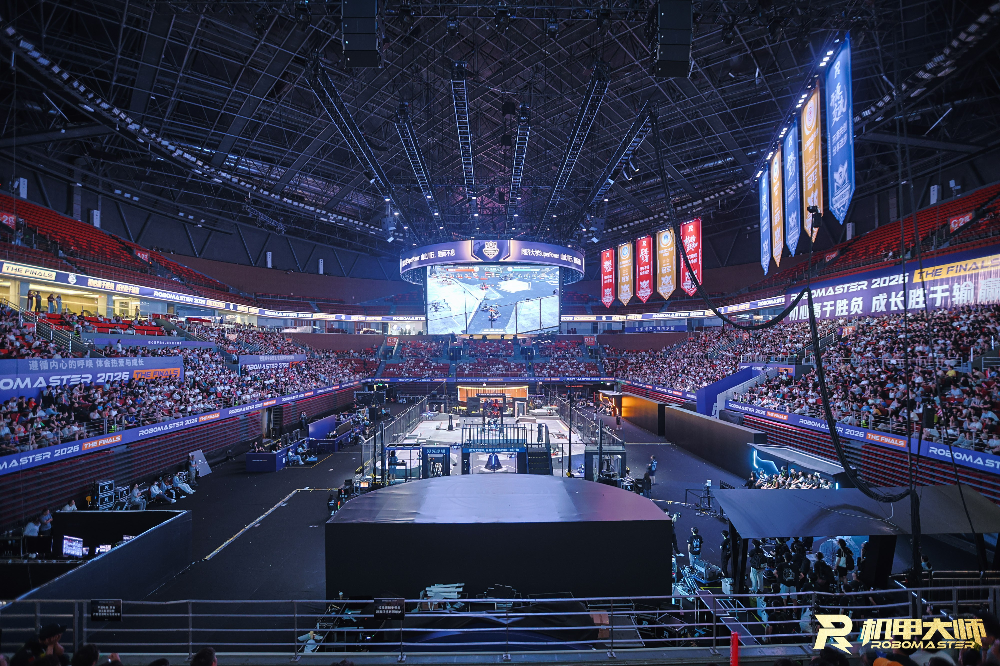

## 关于 RM 与视觉组

RoboMaster（全国大学生机器人大赛）是由大疆创办的机器人对抗赛事，
参赛队伍自主设计、研发并操控步兵、英雄、哨兵、工程等机器人，
在赛场进行 7v7 对抗。

浙江大学 RoboMaster 视觉组（ZJU Vision Group）隶属于浙大 RoboMaster 战队
「Hello World」，是整个战队中负责机器人**视觉感知与自主决策**的核心小组。
我们用代码让机器人看懂赛场、自行决策——自瞄锁定目标、能量机关识别、
哨兵自主巡航、步兵强化学习……每一发精准的弹道背后，都有一套视觉算法在实时运转。

### RM 的价值

RoboMaster 是**国家认定的 A 类竞赛**，其含金量与认可度处于同类赛事的顶格水平。
参加视觉组、投身 RM，意味着你不仅能做出真正上场的机器人，还能获得实打实的回报：

- **课内学分**：竞赛成果可在课内折算获得 **2 课分与 3 课分**。
- **保研加分**：竞赛奖项在保研评定中可获得加分。
- **升学与就业**：获得奖项后，可以走**特招**、**免面试**或**内推**等通道进入相关企业；
  RM 的经历与技术积累在企业中认可度极高。
- **RM Award**：RM 的个人最高荣誉，代表对**机械、嵌入式、算法或管理**等方面人才的
  极度肯定与认可，是对个人综合能力最有分量的权威认证。

## 技术方向

我们覆盖机器人视觉与决策的完整技术栈，主要方向包括：

- **自瞄（Auto-Aim）**：目标检测、位姿解算与云台控制闭环，让机器人稳定锁定并击打移动目标。
- **哨兵自主决策（Sentry Decision）**：全自主的哨兵机器人——感知、决策、移动、开火，一人一车独当一面。
- **神经网络训练（Neural Network Training）**：目标识别、装甲板检测等模型的训练、部署与推理优化。
- **雷达站开发（Radar Station）**：雷达站的全栈开发工作——视野外的信息优势，全局战场态势感知。
- **自定义客户端（Custom Client）**：自研的串口/网络客户端与上位机工具，打通上下位机通信链路。
- **仿真模拟（Simulation）**：基于仿真的算法验证与机器人训练环境，让代码在真机之前先在虚拟战场里跑通。
- **步兵强化学习（RL for Infantry）**：用强化学习训练步兵的移动，让机器人学会"走位"。

## 培养体系

我们的培养体系不靠课堂，靠实战与传承。

### 入组培训

新入组的同学会先从 [入组培训文档](/induction-training) 开始，系统学习
网络配置、Linux、Git、ROS2、OpenCV、相机标定、自瞄框架、上下位机通信等
全套技术文档。这份文档由历届成员沉淀而成，是每个新人进入视觉组的起点。

### 技术文档交接

视觉组高度依赖**技术文档交接**：所有关键知识与踩坑经验都以文档形式沉淀下来。
在这里，**主要靠自学**——文档已经为你铺好了路，看不懂就去查、去试、去问。
组内的老人会热心帮助新人解答问题，但**没有课程式的教导**。
我们希望每个人都具备独立解决问题的工程师素养。

### 考核

入组考核分为两部分：

1. **笔试**：考察培训文档中的基础理论。
2. **Project**：完成一个完整的实践项目，过程中会有**两次软件层面的检查**
   帮助你逐步迭代；最终目标是让你的 project **跑在云台上**，
   完成一个包含上位机与下位机的完整项目。

项目通过考核，你就正式成为视觉组的一员，开始真正的战场开发。

### 成员构成

成员分为**正式队员**与**梯队队员**：

- **正式队员**：承担视觉组的核心开发工作，是各技术方向的主力。
- **梯队队员**：承担较为轻量的工作，主要目的是学习和积累；
  表现优异者可以转为正式队员，承担更核心的任务。

## 我们期待的你

> **勤奋、能吃苦、争强好胜、有荣誉感 —— 这就是我们要的人。**

我们希望这样的人加入视觉组：

- **勤奋、能吃苦**——视觉组的开发没有捷径，付出是唯一的门票。
- **目标导向**——能**提前完成项目要求**，而不是卡着截止日期交差。
- **脚踏实地**——愿意把代码搬上真机、进行**实地测试**，**不纸上谈兵**。
- **争强好胜、有荣誉感**——我们想要的是**想赢的人**。

如果你是这样的人，即使刚开始对 RM 了解甚少，也可以通过自己的努力、
在 AI 工具的帮助下，快速成长为一个**卓越的工程师**。

> **我们不欢迎：抱着"混一混"的态度、多次拖延进度的人。**
> 这样的人既是对自己的机器人不负责，也是对队友不负责。
